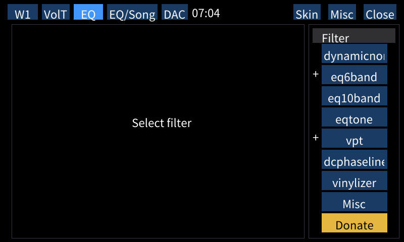
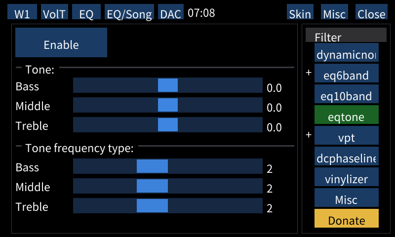
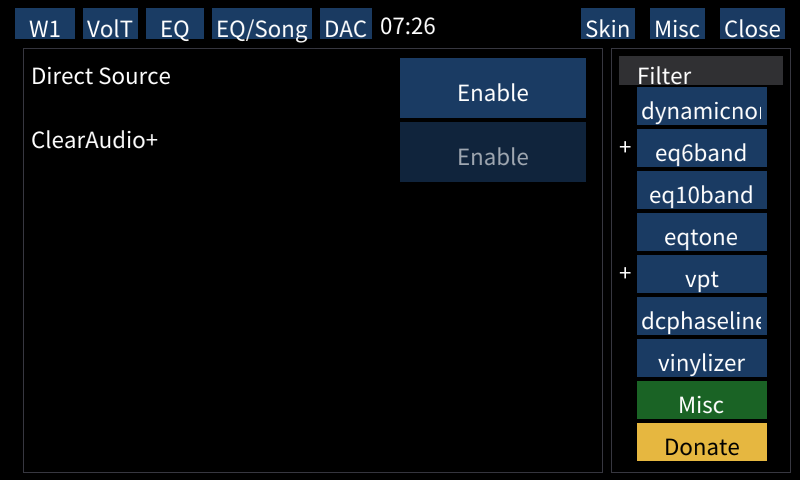

# Equalizer / audio filters

Wampy provides access to following audio filters on your DAP regardless of device and firmware version:

- Dynamic Normalizer
- VPT
- Equalizer (6 band)
- Equalizer (10 band)
- Tone control
- DC Phase Linearizer
- Vinyl Processor
- Direct Source

ClearAudio+ is available only on NW-A50.

Filter chain list is on the right side; audio passes filters from top to bottom. Currently active filters are marked
by `+`.

## General notes

**Filter status updates only when music is playing**. To enable filter, tap on `Enable` button and start music if it's
not already on.

All changes will **NOT** be reflected in standard interface; if you use this tab, consider it the source of truth.

DSEE is available only in standard interface; there is a software difference not allowing all variants everywhere.

Clear Phase is available only in standard interface on supported devices.

All filters are compatible with "EQ per song" options (except Dynamic Normalizer).

## Filters

### Dynamic normalizer

No options, just on/off toggle

### 6 Band equalizer

6 Band equalizer from NW-A30/40/50 with built-in presets. Set preset to "Custom 1/2" to make changes.

### 10Band equalizer

10Band equalizer from ZX300 / WM1A/Z.

### Tone control

Tone control feature from ZX300 / WM1A/Z.

There is a `Tone frequency type` option (not available in standard interface) which is 2 by default. There is no audible
difference between values; if you can measure the difference [like this][1], please tell about the results.

**Important note**: tone control can *significantly* increase output volume when used with other filters such as
equalizer.

### VPT

VPT feature from A30/40/50. 4 presets.

### DC Phase Linearizer

Supports 6 presets from ZX300 / WM1A/Z.

Note: I was unable to hear difference between presets on stock NW-A50. If you notice changes and can measure
them [like this][1], please tell about the results.

### Vinylizer

Supports 4 presets from ZX300 / WM1A/Z plus unnamed preset from NW-A50.

Note: I was unable to hear difference between presets on stock NW-A50. If you notice changes and can measure
them [like this][1], please tell about the results.

### ClearAudio+, Direct Source

Direct Source from ZX300 / WM1A/Z. Does NOT pull filters from active chain when enabled (`+` marks stay on), most likely
ignores chain altogether.

ClearAudio+ is available only on NW-A50; other models are unaware of this option.

## Making of

You can read about development process [here](./MAKING_OF_EQUALIZER_FILTERS.md).

[1]: https://www.head-fi.org/threads/sony-walkman-custom-firmware-non-android.943661/post-18092878