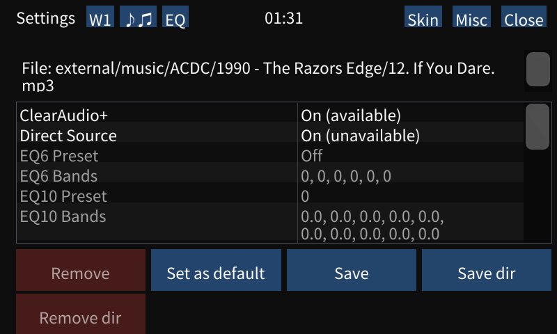
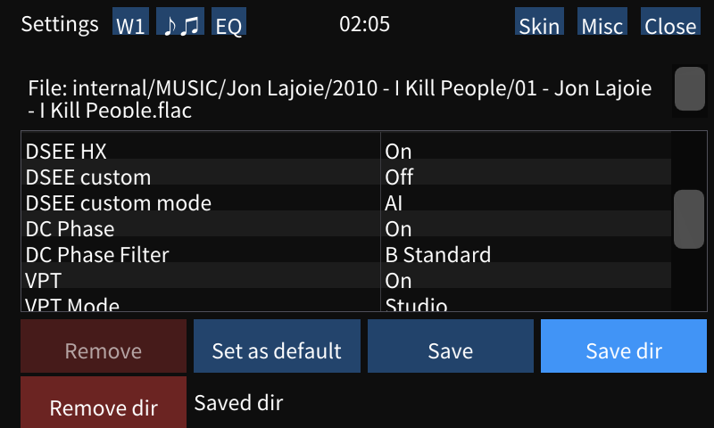

# Equalizer settings

Wampy can conditionally change equalizer settings depending on currently playing song.

Enable it on "EQ" tab (or toggle it on/off on "Misc" tab). You can also press "EQ" button in Winamp.

Settings are saved per file or per directory. Setting list:

- ClearAudio+ (NW-A50)
- Direct Source
- EQ6 Preset (NW-A50)
- EQ6 Bands (NW-A50)
- EQ10 Bands
- DSEE HX (NW-A50)
- DSEE custom
- DSEE custom mode
- DC Phase
- DC Phase Filter
- VPT (NW-A50)
- VPT Mode (NW-A50)
- Tone Control or 10 band EQ?
- Tone Control Low
- Tone Control Mid
- Tone Control High
- Vinyl Processor
- Vinyl Type
- DN (?)

Options without model are available on Walkman One, ZX-300 and NW-WM1A/Z.

No, you won't be able to enable Direct Source or Tone Control on firmwares without these options being already enabled
(like NW-A50 stock). Manually editing equalizer database won't change much, usually you get a "system error" popup on
incompatible settings.

### Usage

Turn on the option, visit the settings page.

`Set as default` sets current values as default ones. When there is no record for currently playing file in equalizer
database, these will be used instead. Default record is automatically created on first launch.

`Save` button saves currently used settings for this file (`12. If You Dare.mp3`)

`Save dir` saves settings for directory (that would be `1990 - The Razors Edge` directory). Settings will be applied to
all files in it.

`Remove` and `Remove dir` buttons remove settings for file and directory respectively.

Equalizer settings are refreshed on song change and after toggling Wampy.

Tap on status text to clear it.

### Example

This screenshot was taken from NW-A50 stock firmware (DSEE custom mode and DC Phase filters are not supported).

Directory with Jon Lajoie's album `2010 - I Kill People` on internal storage is using following settings:

- DSEE HX: On
- DC Phase: On, B Standard (default on NW-A50, cannot change)
- VPT: On, Studio mode

Songs from other directories will use default settings if there is no corresponding record in equalizer database.

### Issues

There is a ~1 sec skip on song start if there is a huge change like toggling ClearAudio+.

### Notes

After switching from stock to Walkman One (and vice versa) you should remove database file to avoid mixing settings. It
is located in `wampy/` directory on internal storage with a name of `eqSettings.dat`.

There is a "NW-A50 default mode?" vinyl type on stock NW-A50 firmware. I am not sure what it actually is, stock firmware
resets mode to this value. There is no special mode entry for it in standard player, most likely it falls back to
"Standard" mode.

There is a mysterious `DN` option (id `DMP_CONFIG_SS_DN_ONOFF`). If this option is On for you, please tell me how do
you toggle it so the description could be updated.

### See also

[Making of equalizer](./MAKING_OF_EQUALIZER.md)