## How Wampy was made

<!-- TOC -->

* [How Wampy was made](#how-wampy-was-made)
* [iRiver](#iriver)
* [Apple](#apple)
* [Walkman](#walkman)
  * [Nuisances](#nuisances)
  * [Exploring the software](#exploring-the-software)
    * [SensMe™ Channels](#sensme-channels)
    * [Scrobbling](#scrobbling)
      * [Getting song info](#getting-song-info)
    * [My own GUI?](#my-own-gui)
      * [Audacious 4.2](#audacious-42)
      * [Linamp](#linamp)
      * [Winamp Skin Museum](#winamp-skin-museum)
      * [Physical renders](#physical-renders)
      * [Adafruit PyPortal Winamp](#adafruit-pyportal-winamp)
      * [Anniversary cassette](#anniversary-cassette)
* [Wampy](#wampy)
  * [Choosing software stack](#choosing-software-stack)
  * [Drawing what we want](#drawing-what-we-want)
    * [Kernel module?](#kernel-module)
    * [V4L2?](#v4l2)
    * [Back to Qt](#back-to-qt)
  * [Getting song data, again](#getting-song-data-again)
  * [Communicating with clients](#communicating-with-clients)
  * [Winamp](#winamp)
    * [Drawing images](#drawing-images)
    * [Text](#text)
    * [Visualization](#visualization)
    * [Timings](#timings)
    * [User skins](#user-skins)
  * [Cassette](#cassette)
  * [Client misc](#client-misc)
  * [Settings](#settings)
  * [Config file](#config-file)
  * [NW-WM1Z / Walkman One compatibility](#nw-wm1z--walkman-one-compatibility)
  * [Build](#build)
    * [Cross-compilation](#cross-compilation)
    * [Qt](#qt)
  * [Upgrade process](#upgrade-process)
    * [Booting](#booting)
    * [Back to upgrading](#back-to-upgrading)
    * [Walkman One compatibility (again)](#walkman-one-compatibility-again)
  * [Installing](#installing)
    * [Windows](#windows)
      * [NSIS](#nsis)
  * [Testing](#testing)
  * [Documentation](#documentation)
  * [Licensing](#licensing)
  * [Publishing code](#publishing-code)

<!-- TOC -->

## iRiver

It all started with iRiver T10.

<figure>
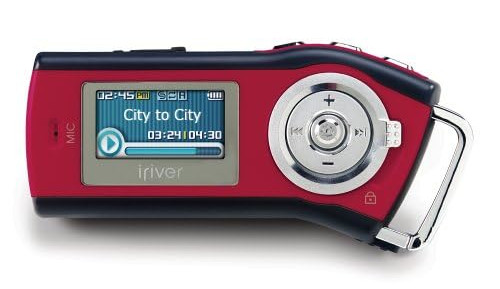
<figcaption>Source: woot.com</figcaption>
</figure>

A device with 512 MB powered by AA battery capable of playing MP3/OGG/WMA, FM radio support, physical buttons and
display introduced me to the world of portable music players and set a quality bar that is hard to surpass up to this
day.

Time has passed, technology moved on and iPod Touch 2G joined my device collection.

## Apple

<figure>

<figcaption>Source: Apple</figcaption>
</figure>

32 GB of music, applications, video and web browsing on huge screen, what a time it was. However, there was one problem
called iTunes, which was required to transfer any content. It took quite some time to get used to, but it also gave a
reason to keep music library in order.

<figure>
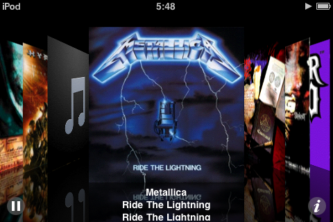
<figcaption>Source: personal screenshot</figcaption>
</figure>

Cover flow was truly magical, replicating physical browsing of your CD collection using your fingers. Shame they got rid
of it in later iOS versions.

Oh, and video had to be converted to specific codec combination which I can't recall, but there is a faint memory of
spending hours waiting for movies to convert. Subtitles had to be hardcoded too. Proprietary cable was pricey.
Jailbreaking was an adventure with a chance of bricking. What a time indeed.

Just like any Apple product, iPod had non-removable battery and after ~6 years it finally died (along with mini jack).

At that time there were no nice alternatives, so I had to get the only MP3 player with acceptable price/quality ratio:
iPod Nano 7G.

<figure>

<figcaption>Source: Apple</figcaption>
</figure>

Insanely thin, lightweight, 5 buttons, headphones that fit and never fall out, FM radio, video/pictures - it was almost
the device I was looking for. You could even hold middle cradle button to listen to name of currently played song if you
didn't want to pull player out.

Then came the pitfalls: 16 GB is not enough, cable is still proprietary, non-removable battery, metal case gets cold in
winter, iTunes is not required, but still better than copying files by hand.

Battery started to die after ~4 years, and it was time to get another player. Lessons were learnt: I didn't want iTunes
standing between me and my device anymore; more storage was needed.

Guess what, Apple stopped making iPods to focus on iPads/iPhones/whatever. It was time to leave Apple behind.

Requirements:

- not Apple-produced
- extendable storage (sd card?)
- FM radio
- mini jack
- display
- possible disassembly
- affordable price ($400 is not affordable)

At that time there was only one device from respectable manufacturer: Walkman NW-A50 series.

## Walkman

<figure>
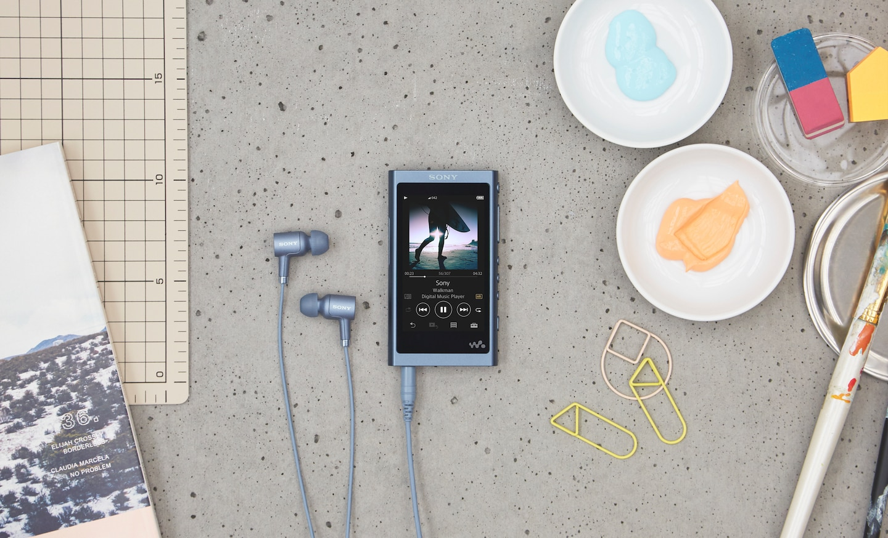
<figcaption>Source: SONY</figcaption>
</figure>

Take a look at that pretty block of electronics.

Of course, there were some nuisances.

### Nuisances

- Proprietary cable (they got rid of it in later models)
- metal frame (remember, winters are cold)
- weight/size (compared to iPod Nano)
- UI imperfections

Metal frame was probably used to add that "premium" feel - you know, slowly pulling out your shiny heavy metal device
with "SONY" on top of it.

> The premium aluminium milled frame provides superior rigidity for low impedance and clear, stable sound and solid
> bass.

Uhh okay, what about plastic cover in the back? Frame is made of metal only in front and sides.

- Buttons started to wiggle a little after some time.
- There is a noticeable lag between pressing power button to turn screen on and screen lit up.
- Metal frame is collecting dents, display gets scratches. Should've bought protective case I guess.
- There is an unskippable "creating database" popup on every boot, even when nothing changed.
- Album art is not displayed if it is encoded as interlaced JPEG .
- Clock is not displayed anywhere except in settings! Even iRiver T10 from 2005 had clock on screen.

<figure>
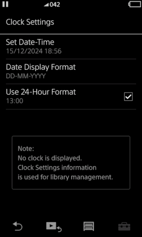
</figure>

Why no clock? There are three theories. First, music is a divine gift from gods; time must not be taken into account
while using Sony Walkman®. Take a look at the guy below, can you imagine him pausing his favorite Merzbow song because
it's 5 o'clock? Me neither.

<figure>

<figcaption>Source: SONY</figcaption>
</figure>

Second theory is that updating clock every second is battery-consuming, so they removed it to increase playback time.
Clock came back in later Android-based models (such
as [NW-WM1AM2](https://electronics.sony.com/audio/audio-components/hi-res-audio/p/nwwm1am2)), but there were a lot of
complaints about reduced battery time. Could it be the clock? We just don't know.

Third theory is that UI designers couldn't fit 4 numbers and a colon into top bar. iRiver T10 could, iPods could.
Perhaps this technology was lost?

- Lyrics icon is just an icon, you need to go to `Toolbox->Display lyrics`, which is 2 taps instead of just tapping the
  icon.

<figure>

</figure>

- There is a "bookmark list" feature; what is even it for? Bookmarks are not exportable, just like playlists. That's
  right, if you want to edit a playlist, you'll have to do it on that `3.1-inch (7.8 cm), WVGA(800 x 480 Pixels)`
  display.
  Perhaps this is some power user feature, if you actually use it, please tell me how.

- Volume buttons on my wired Apple headphones don't work, but they do on my Samsung tablet. Why?

- What is the `Hold` button for, preventing accidental button presses? In my experience it is pretty hard to press
  button
  with something else in my pocket. There is also an option to keep touchscreen enabled while `Hold`ing - for what
  purpose? So screen is on (meaning you are looking at it and capable of doing anything), fully usable, but buttons are
  off? Can't imagine a situation where I needed such behaviour.

- Play, Prev and Hold physical buttons (in the bottom half of the device) are unreachable if you hold the player with
  right hand. Solution? Use left hand, just like on this promo image:

<figure>

<figcaption>Source: SONY</figcaption>
</figure>

Honestly, I believe that this is a curse that was cast by Apple. Every device must be brick-shaped, leaving almost no
controls. I am pretty sure that all comfortable button layouts and some UX elements are already patented by
Apple - [take a look](https://patents.google.com/?inventor=Steven+P.+Jobs).

### Exploring the software

#### SensMe™ Channels


It started with [SensMe™](https://en.wikipedia.org/wiki/SensMe). SensMe™ is a technology which detects mood/tempo in
your audio track. This technology is made by Gracenote, Inc. (despite what Wikipedia says). It works like this: audio
file is played into highly compressed version of itself and then stored into `SMFMF` ID3 tag. Then client (player
software) reads that tag, possibly reanalyzing compressed data and saves mood data to internal database <citation
needed, not sure about that>. This mechanism is decades old and backwards compatible, tracks analyzed with
[Sony Media Center from like 2009](https://archive.org/download/SonyEricssonC510) are recognized by NW-A50 from 2018.

Why do I even care? First, it takes some time to analyze a song, like 10 seconds each. You need to launch Sony media
application (Electron garbage) (which barely works on Linux), load all your tracks into it and wait for hours. Then your
audio file grows by almost a megabyte of `SMFMF` data, possibly corrupting ID3 tags in process (unacceptable). So I
deciced to take a look at what's going on.

Is there a way of faster and smaller tagging? Mood should be like what, 10 bytes of ids, right (Energetic (0x01)=10,
Relaxing (0x02)=2, Mellow (0x03)=0.5)? Tempo is literally a number, a sequence of numbers if it changes during song,
not a megabyte. Perhaps I could feed my music to music-specialized LLM and write those bytes myself?

So I tried to reverse engineer the format (and failed). There are at least 3 backwards-compatible
versions of `SMFMF` data. It includes compressed song <in what format? citation needed> and various metadata in binary
form. Unfortunately there was not enough time to investigate it further, but at least I managed to reverse engineer
server-client communication between local client and Gracenote servers, which is used to identify your song. Had fun,
but nothing new about `SMFMF`.

#### Scrobbling


Last.fm is built around scrobbling - recording info online about songs you listen to. iPods supported scrobbling -
Last.fm client was pulling song data from exposed `MTPDB.dat` file. However, Walkmans do not support scrobbling. Song
data is not exposed, `listened` events are not even recorded. Stats are for nerds; premium SONY Walkman® devices are NOT
for nerds.

What can we do at this point? That's right, [Rockbox](https://www.rockbox.org/wiki/SonyNW), which supports scrobbling
and stuff! Except our device is not supported and most likely won't be. Reasons? Sony has nice sound enhancement
technologies, by installing Rockbox you'll lose access to DSEE HX, VPT and other abbreviations.

There is firmware packer/unpacker, with which you can make your own firmware modification. This is how I
bricked my device: by writing incorrect upgrade script, which caused infinite boot-upgrade loop. Player was disassembled
in attempt to find magical pins to short to reset update flags in memory. There are no such pins; tore NFC cable in
process and discovered that back cover is actually plastic.

At this point I almost gave up and started looking for Sony Service Center nearby, but just before that tried connecting
device with various buttons held (just like in good old iPod jailbreaking days). It turned out that NW-A50 is built on a
MediaTek platform which is vulnerable to exploits. I was able to dump whole device, edit firmware and put it back on;
see [BACKUP.md](./BACKUP.md). **Always** make a backup before flashing custom software to device. After that I finally
had root shell.

---

All right, back to scrobbling. At a glance, there are three steps: record "song started" time, wait for song to be
played for at least 50%, write song info into file, done. That's if you have song info, which you don't.

##### Getting song info

All song info is saved in `/db/MTPDB.dat` file, which is a regular SQLite database. But how do we know which song is
playing right now? What's the duration?

Here is where I made a mistake making me lose months (and having fun in process). I decided to join player software
stack instead of just reading data from log. There are at least 20 services responsible for their part, such as NFC,
Bluetooth, Sound, Database, etc. communicating
using [Binder](https://developer.android.com/reference/android/os/Binder). There must be a way to communicate with them
just like main application does.

<details>
<summary>Processes</summary>

```shell
# busybox ps f                 
PID   USER     TIME   COMMAND
    1 root       0:01 /init  
    2 root       0:00 [kthreadd]
    3 root       0:00 [ksoftirqd/0]
    5 root       0:00 [kworker/0:0H]
    7 root       0:00 [migration/0]
    8 root       0:00 [rcu_preempt]
    9 root       0:00 [rcu_bh]
   10 root       0:00 [rcu_sched]
   11 root       0:00 [migration/1]
   12 root       0:00 [ksoftirqd/1]
   14 root       0:00 [kworker/1:0H]
   15 root       0:00 [khelper]
   16 root       0:00 [netns]
   17 root       0:00 [fs_sync]
   18 root       0:00 [suspend]
   19 root       0:00 [GCPU]
   20 root       0:00 [update_tz_count]
   21 root       0:00 [entropy_thread]
   22 root       0:00 [writeback]
   23 root       0:00 [bioset]
   24 root       0:00 [kblockd]
   25 root       0:00 [khubd]
   26 root       0:02 [khubd_poll]
   27 root       0:00 [md]
   28 root       0:00 [pmic_thread_kth]
   29 root       0:00 [touch_freq_up_t]
   31 root       0:00 [emi_mpu]
   32 root       0:00 [kswapd0]
   33 root       0:00 [fsnotify_mark]
   34 root       0:00 [crypto]
   49 root       0:00 [cradle_wq]
   50 root       0:00 [kworker/u5:0]
   52 root       0:00 [ion_mm_heap]
   53 root       0:00 [ion_mm_carveout]
   54 root       0:00 [binder]
   55 root       0:00 [hang_detect]
   56 root       0:00 [btif_rxd]
   57 root       0:00 [mtk_vibrator]
   58 root       0:00 [synaptics_wq]
   59 root       0:00 [himax_hx8526_wq]
   60 root       0:02 [battery]
   61 root       0:00 [wmport_vbus]
   62 root       0:00 [cxd224x-i2c_wro]
   63 root       0:03 [mmcqd/0]
   64 root       0:00 [mmcqd/0boot0]
   65 root       0:00 [disp_config_upd]
   66 root       0:00 [sensor_polling]
   67 root       0:00 [mmcqd/0boot1]
   68 root       0:00 [usb0_ack_state]
   69 root       0:00 [usb0_g_state]
   70 root       0:00 [mmcqd/0rpmb]
   71 root       0:00 [deferwq]
   72 root       0:00 [disp_captureovl]
   73 root       0:00 [disp_capturefb_]
   74 root       0:10 [disp_config_upd]
   75 root       0:00 [ovl_eng_wq]
   76 root       0:00 [ovl_eng_wq]
   77 root       0:00 [ovl_eng_wq]
   78 root       0:01 [ovl_engine_kthr]
   79 root       0:07 [rdma0_update_kt]
   80 root       0:00 [mtkfb_ovls_wq]
   82 root       0:00 [wdtk-0]
   83 root       0:00 [wdtk-1]
   84 root       0:00 [mtkv_bh]
   85 root       0:00 [mtkv_bh_s]
   86 root       0:00 [mtkv_mdp]
   87 root       0:00 [f_mtp]
   88 root       0:01 [file-storage]
   89 root       0:00 /sbin/ueventd
   91 root       0:01 [kworker/0:1H]
   92 root       0:00 [jbd2/mmcblk0p19]
   93 root       0:00 [ext4-dio-unwrit]
  103 root       0:00 [kworker/1:1H]
  113 root       0:00 [jbd2/mmcblk0p20]
  114 root       0:00 [ext4-dio-unwrit]
  115 root       0:00 [jbd2/mmcblk0p28]
  116 root       0:00 [ext4-dio-unwrit]
  117 root       0:00 [jbd2/mmcblk0p23]
  118 root       0:00 [ext4-dio-unwrit]
  119 root       0:00 [jbd2/mmcblk0p24]
  120 root       0:00 [ext4-dio-unwrit]
  121 root       0:00 [jbd2/mmcblk0p25]
  122 root       0:00 [ext4-dio-unwrit]
  124 root       0:00 [jbd2/mmcblk0p26]
  125 root       0:00 [ext4-dio-unwrit]
  126 root       0:00 [jbd2/mmcblk0p27]
  127 root       0:00 [ext4-dio-unwrit]
  129 root       0:01 /system/xbin/icx_syslog -n 32 -l 6 -d /emmc@var
  146 root       0:00 system/bin/dpfd
  147 system     0:00 /bin/mtkbt > /tmp/mtkbt.log
  149 root       0:00 [mtk_stp_psm_a]
  150 root       0:00 [mtk_stp_btm_a]
  151 root       0:00 [mtk_wmtd_a]
  183 root       0:00 [icx_carddet]
  186 root       0:00 nvram_rw
  222 root       0:00 /system/bin/6620_launcherA -p /system/etc/firmware/
  242 root       0:03 [mmcqd/1]
  272 root       0:00 /system/xbin/icx_hdump_log -c
  273 root       0:00 /sbin/adbd --root_seclabel=u:r:su:s0
  275 1005       0:00 /bin/logwrapper /system/vendor/sony/bin/hagodaemon userAndGroup=system,system groups=log,chrome capabilities=5,22 daemonNum=28
  276 system     0:00 /bin/logwrapper /system/vendor/sony/bin/hagodaemon appmgrservice sub_sm
  277 1005       0:00 /bin/logwrapper /system/vendor/sony/bin/hagodaemon PowerService sub_sm
  278 system     0:00 /bin/logwrapper /system/vendor/sony/bin/hagodaemon EventRouter sub_sm
  279 1005       0:00 /bin/logwrapper /system/vendor/sony/bin/hagodaemon TimerService capabilities=1,3,25,35 userAndGroup=system,system sub_sm
  280 1005       0:00 /bin/logwrapper /system/vendor/sony/bin/hagodaemon WMPortService KeyService ConfigurationService DisplayService userAndGroup=system,system capabilities=1,12 sub_sm
  281 system     0:00 /bin/logwrapper /system/vendor/sony/bin/hagodaemon UpdateService sub_sm
  282 1005       0:00 /bin/logwrapper /system/vendor/sony/bin/hagodaemon UsbHostConnectionService UsbDeviceConnectionService UsbDeviceAudioPlayerService userAndGroup=system,system capabilities=1,12 n
  283 1005       0:00 /bin/logwrapper /system/vendor/sony/bin/hagodaemon MediaStoreService PlayerService userAndGroup=system,system capabilities=13 sub_sm
  284 1005       0:00 /bin/logwrapper /system/vendor/sony/bin/hagodaemon OneTrackPlayerService userAndGroup=system,system sub_sm
  285 1005       0:00 /bin/logwrapper /system/vendor/sony/bin/hagodaemon SoundServiceFw capabilities=23 userAndGroup=system,system nice=-15 sub_sm
  286 1005       0:00 /bin/logwrapper /system/vendor/sony/bin/hagodaemon NcServiceFw userAndGroup=system,system capabilities=12 sub_sm
  287 1005       0:00 /bin/logwrapper /system/vendor/sony/bin/hagodaemon VolumeServiceFw userAndGroup=system,system sub_sm
  288 1005       0:00 /bin/logwrapper /system/vendor/sony/bin/hagodaemon VolumeGlue userAndGroup=system,system sub_sm
  289 1005       0:00 /bin/logwrapper /system/vendor/sony/bin/hagodaemon RecorderService userAndGroup=system,system sub_sm
  290 1005       0:00 /bin/logwrapper /system/vendor/sony/bin/hagodaemon AudioAnalyzerService userAndGroup=system,system sub_sm
  291 1005       0:00 /bin/logwrapper /system/vendor/sony/bin/hagodaemon ConnMgrServiceFw userAndGroup=system,system sub_sm
  292 1005       0:00 /bin/logwrapper /system/vendor/sony/bin/hagodaemon FuncMgrServiceFw userAndGroup=system,system sub_sm
  293 1005       0:00 /bin/logwrapper /system/vendor/sony/bin/hagodaemon PathMgrServiceFw userAndGroup=system,system sub_sm
  294 1005       0:00 /bin/logwrapper /system/vendor/sony/bin/hagodaemon PowerMgrServiceFw userAndGroup=system,system capabilities=12 sub_sm
  295 1005       0:00 /bin/logwrapper /system/vendor/sony/bin/hagodaemon RemoteCmdInjCtrlDaemon userAndGroup=system,system sub_sm
  296 1005       0:00 /bin/logwrapper /system/vendor/sony/bin/hagodaemon UsbMgrServiceFw userAndGroup=system,system capabilities=12 sub_sm
  300 root       0:30 /system/vendor/unknown321/bin/wampy
  302 1005       0:00 /bin/logwrapper /system/vendor/sony/bin/hagodaemon StorageMgrServiceFw sub_sm
  303 1005       0:00 /bin/logwrapper /system/vendor/sony/bin/hagodaemon WiredHpServiceFw userAndGroup=system,system capabilities=12 sub_sm
  304 system     0:00 /bin/logwrapper /system/vendor/sony/bin/hagodaemon NfcService sub_sm
  305 1005       0:00 /bin/logwrapper /system/vendor/sony/bin/hagodaemon MemmonService sub_sm
  306 system     0:00 /bin/logwrapper /system/vendor/sony/bin/hagodaemon BtCommonService BtTransmitterService BtBleCommonService BtBleRemoteService BtPlayerService capabilities=23 sub_sm
  307 1005       0:00 /bin/logwrapper /system/vendor/sony/bin/hagodaemon AudioInPlayerService TunerPlayerService userAndGroup=system,system nice=-10 sub_sm
  308 system     0:01 /system/vendor/sony/bin/hagodaemon userAndGroup=system,system groups=log,chrome capabilities=5,22 daemonNum=28
  309 root       0:10 /system/vendor/unknown321/bin/scrobbler
  310 root       0:00 {PowerService} /system/vendor/sony/bin/hagodaemon PowerService sub_sm
  311 system     0:00 {appmgrservice} /system/vendor/sony/bin/hagodaemon appmgrservice sub_sm
  312 system     0:15 {WMPortService} /system/vendor/sony/bin/hagodaemon WMPortService KeyService ConfigurationService DisplayService userAndGroup=system,system capabilities=1,12 sub_sm
  313 system     0:03 {TimerService} /system/vendor/sony/bin/hagodaemon TimerService capabilities=1,3,25,35 userAndGroup=system,system sub_sm
  314 system     0:00 {PathMgrServiceF} /system/vendor/sony/bin/hagodaemon PathMgrServiceFw userAndGroup=system,system sub_sm
  315 system     0:00 {UsbHostConnecti} /system/vendor/sony/bin/hagodaemon UsbHostConnectionService UsbDeviceConnectionService UsbDeviceAudioPlayerService userAndGroup=system,system capabilities=1,12
  316 system     0:00 {ConnMgrServiceF} /system/vendor/sony/bin/hagodaemon ConnMgrServiceFw userAndGroup=system,system sub_sm
  317 root       0:00 {MemmonService} /system/vendor/sony/bin/hagodaemon MemmonService sub_sm
  318 system     0:00 {FuncMgrServiceF} /system/vendor/sony/bin/hagodaemon FuncMgrServiceFw userAndGroup=system,system sub_sm
  319 root       0:00 {StorageMgrServi} /system/vendor/sony/bin/hagodaemon StorageMgrServiceFw sub_sm
  320 system     0:00 {RemoteCmdInjCtr} /system/vendor/sony/bin/hagodaemon RemoteCmdInjCtrlDaemon userAndGroup=system,system sub_sm
  321 system     0:00 {WiredHpServiceF} /system/vendor/sony/bin/hagodaemon WiredHpServiceFw userAndGroup=system,system capabilities=12 sub_sm
  322 system    27:53 {SoundServiceFw} /system/vendor/sony/bin/hagodaemon SoundServiceFw capabilities=23 userAndGroup=system,system nice=-15 sub_sm
  323 system     2:58 {MediaStoreServi} /system/vendor/sony/bin/hagodaemon MediaStoreService PlayerService userAndGroup=system,system capabilities=13 sub_sm
  324 system     0:00 {UpdateService} /system/vendor/sony/bin/hagodaemon UpdateService sub_sm
  325 system     0:00 {VolumeServiceFw} /system/vendor/sony/bin/hagodaemon VolumeServiceFw userAndGroup=system,system sub_sm
  326 system     0:00 {EventRouter} /system/vendor/sony/bin/hagodaemon EventRouter sub_sm
  327 system     0:00 {AudioInPlayerSe} /system/vendor/sony/bin/hagodaemon AudioInPlayerService TunerPlayerService userAndGroup=system,system nice=-10 sub_sm
  328 system     0:00 {PowerMgrService} /system/vendor/sony/bin/hagodaemon PowerMgrServiceFw userAndGroup=system,system capabilities=12 sub_sm
  329 system     0:00 {RecorderService} /system/vendor/sony/bin/hagodaemon RecorderService userAndGroup=system,system sub_sm
  330 system     0:00 {UsbMgrServiceFw} /system/vendor/sony/bin/hagodaemon UsbMgrServiceFw userAndGroup=system,system capabilities=12 sub_sm
  331 system     0:00 {VolumeGlue} /system/vendor/sony/bin/hagodaemon VolumeGlue userAndGroup=system,system sub_sm
  332 system     0:00 {NcServiceFw} /system/vendor/sony/bin/hagodaemon NcServiceFw userAndGroup=system,system capabilities=12 sub_sm
  333 system     0:00 {AudioAnalyzerSe} /system/vendor/sony/bin/hagodaemon AudioAnalyzerService userAndGroup=system,system sub_sm
  334 system     0:00 {OneTrackPlayerS} /system/vendor/sony/bin/hagodaemon OneTrackPlayerService userAndGroup=system,system sub_sm
  335 system     0:01 {BtCommonService} /system/vendor/sony/bin/hagodaemon BtCommonService BtTransmitterService BtBleCommonService BtBleRemoteService BtPlayerService capabilities=23 sub_sm
  336 system     0:00 {NfcService} /system/vendor/sony/bin/hagodaemon NfcService sub_sm
  351 system     2:48 HgrmMediaPlayerApp
  801 root       0:00 [kworker/1:2]
 1018 root       0:00 [kworker/1:0]
 1060 root       0:00 [kworker/u4:0]
 1069 root       0:00 [kworker/0:1]
 1070 root       0:00 [kworker/u4:1]
 1072 root       0:00 [kworker/u4:2]
 1081 root       0:00 [kworker/0:2]
 1082 root       0:00 [kworker/0:3]
```

</details>

After some months directory with ghidra disasembly/debugging data grew up to 2.1 GB. A lot of lessons were
learnt about C++, vtables, ARM, inheritance, toolchains, compilers, cross-compiling, ELF and other nonsense. An
application was produced which was able to change volume pretending to be a genuine Volume Service client. I was ready
to grab song info… or was I?

Here is the mistake: in server-client communication server keeps data for each client separately, meaning that I got
nothing after connecting to `PlayerService`. In order to get info about playing song my client had to be the one that
initiated playback. There are some other hacks, like injecting into GUI application to grab info from there or messing
with Binder, but these were considered way too hard to get info I wanted.

At that point I took a break and made a decision to use system log, which provided enough info. Here is the
result - [scrobbler](https://github.com/unknown321/scrobbler). It just works.

#### My own GUI?


After successfully finishing scrobbler, I decided to take a shot at some GUI issues, such as lack of clock, lyrics icon
and maybe more?

Somewhere around that date Llama Group announced open-sourcing Winamp. There already were some projects recreating that
iconic interface:

- [Audacious](https://audacious-media-player.org/), multiplatform audio player with winamp skin support;
- [Winamp Skin Museum](https://skins.webamp.org/) replicating Winamp experience in your browser;
- [Linamp](https://hackaday.io/project/196407-linamp/), physical Winamp box;
- [Adafruit PyPortal Winamp](https://learn.adafruit.com/pyportal-winamp-mp3-player)
- and some renders like [this](https://x.com/uttamk77/status/1271870451115896834).

Honestly, all of them suck in some way or another. Remember, user experience is EVERYTHING. If your product looks or
feels bad, no one will use it unless in dire need. Your user can compromise and still use your application, but he will
be constantly reminded of your mistakes which is unacceptable. User experience is everything.

##### Audacious 4.2

While looking pixel-perfect, behaviour is far from ideal. Marquee is off, visualization is too fast, track time is
missing
leading zero, "Seek to" text is missing percentage, balance slider is changing position while moving volume slider
([why?](./images/audacious_quality.mp4))...

##### Linamp

Linamp rendering is off, elements are not where they should be because screen is too wide - see photos on project page.

##### Winamp Skin Museum

Winamp Skin Museum is pixel-perfect, but there is a problem of screens growing too big. Take a look:

<figure>
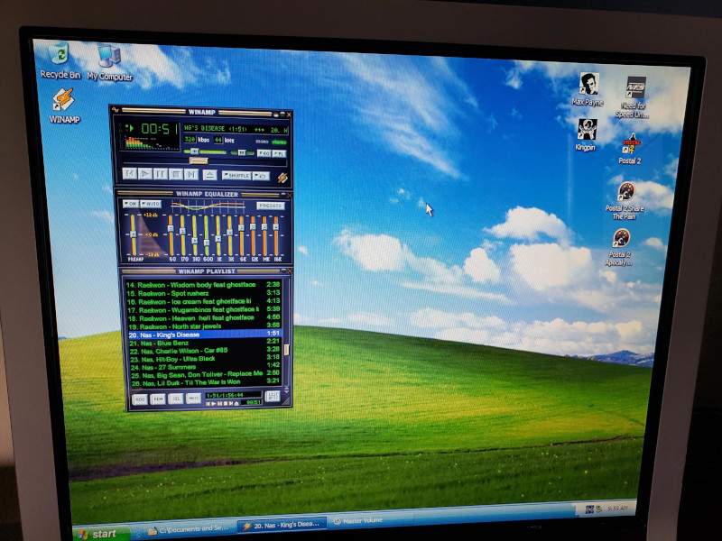
<figcaption>Source: <a href="https://www.reddit.com/r/windowsxp/comments/zyqf6f/waiting_for_my_graphics_card_to_come_in_so_might/">r/windowsxp</a></figcaption>

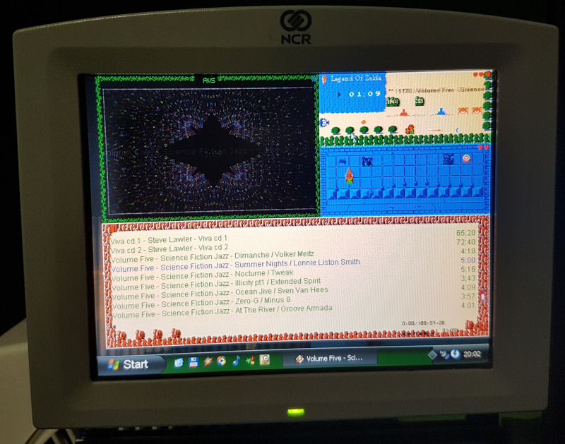
<figcaption>Source: <a href="https://www.reddit.com/r/winamp/comments/1gp0a9w/winamp_fits_so_well_on_this_640480_ncr_realpos/">r/winamp</a></figcaption>
</figure>

Main window takes a huge part of the screen, elements are easily identified, text is readable.

Now take a look at base skin in your
browser - [link](https://skins.webamp.org/skin/5e4f10275dcb1fb211d4a8b4f1bda236/base-2.91.wsz/). Can you read text in
playlist? Buttons are tiny and screen is huge; doubling main window in size looks off.

Technology advanced, Winamp did not. It works only on smaller screens, not 1920x1080 and beyond. (Also, visualisation is
too fast).

##### Physical renders

Physical renders are bad, because they are just that - renders. It would be really awkward to use Winamp buttons
and sliders using fingers, something will be looking off, distance between elements must be changed etc. etc. There is
also usually an unhealthy amount of gloss which puts me off.

##### Adafruit PyPortal Winamp

<figure>
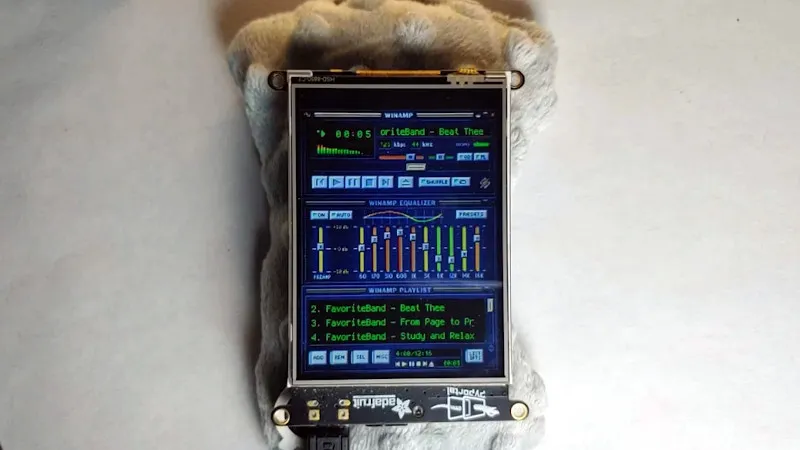
<figcaption>Source: <a href="https://hackaday.com/2022/02/20/winamp-reborn-with-the-adafruit-pyportal/">Hackaday.com</a></figcaption>
</figure>

Now that's looking good. But this is a static image, buttons are not usable...

##### Anniversary cassette


In 2019 Sony added cassette animation to Android
Walkmans - [link](https://www.forbes.com/sites/davidphelan/2019/09/07/sony-40th-anniversary-walkmans-surprise-feature-is-a-scene-stealer/).

<figure>
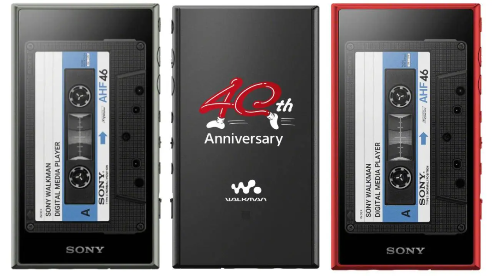
<figcaption>Image source: <a href="https://www.iheart.com/content/2019-09-17-australia-news-the-40th-anniversary-sony-walkman-is-a-modern-take-on-an-icon/">iHeart</a></figcaption>
</figure>

You know, just after NW-A50 was released in 2018. No cassettes for NW-A50 (and other Linux-based players). That sucks.

So here is the idea: write an application which uses Winamp skins and displays cassettes. Also known as Wampy.

## Wampy

Requirements:

- Winamp main window functionality:
  - working track control buttons
  - working position and volume sliders
  - text marquee
  - bitmap fonts
  - playlist at least in read-only form
  - Winamp 2 skin support
  - looks as close as possible to desktop application
- Cassette functionality:
  - changing cassette skin depending on currently playing track
  - displaying artist/title
  - reel animation
  - custom skins
- Additional fixes to default Walkman application:
  - clock
  - lyrics icon
  - something else (big cover)?
- Small memory footprint

### Choosing software stack

There was a temptation of using Go just like I did with scrobbler, but Go has no small-footprint GUI framework.
Maybe [ebiten](https://github.com/hajimehoshi/ebiten)? Qt looks complicated for a C++ newbie. So I decided to go
with [Dear ImGui](https://github.com/ocornut/imgui) - a solution used by thousands with simple-looking code. That also
meant using C/C++, a language with which I had about zero experience prior. All right, client side looks easy - throw
some textures and tell ImGui to draw them. What about server side, which will provide track data?

Initially I was going to use scrobbler, since it has almost all info about currently playing track. There is a socket
ready, just send a command and receive data. But there is no playlist info, no way to switch tracks, change volume...
Time to dive into Walkman player application - `HgrmMediaPlayerApp`.

`HgrmMediaPlayerApp` is a Qt 5.3.2 application written in C++. It serves as a center point in player architecture,
gathering data from all services. I am not acquainted with common code injection methods into Qt applications, but here
is a peek at Kobo software
mod: [NickelMenu](https://github.com/pgaskin/NickelMenu/blob/master/src/nickelmenu.cc). It uses dlsym for intercepting
symbols and running mod code before/after app functions. Tried that before with system services, didn't like it - feels
hacky.

Sony provides full Qt source as a part of their open source
program - https://oss.sony.net/Products/Linux/Audio/NW-A57.html. Perhaps there might be something? And there was
something, source for [eglfs plugin](https://doc.qt.io/qt-5/embedded-linux.html#embedded-eglfs). This library is loaded
at application start and has access to all core Qt functions (advanced functionality can be added later). Great, this
will be our entry point.

But there is another issue - how to display our application over default one? There are some Stack Overflow questions
about that, but no definitive solution. I've spent embarrassing amount of time figuring it out.

### Drawing what we want


Just as usual, task looks easy. After some googling you may find out that there is magic `QT_QPA_EGLFS_FB` env variable,
which points to framebuffer to draw to. Can we tell `HgrmMediaPlayerApp` to temporarily change framebuffer? No, we
can't, this variable is set only on application start.

#### Kernel module?

So here is the idea: let's write framebuffer driver which will be accepting data from both applications (Wampy and
Walkman), but drawing only one (triggered by custom syscall). Made it pretty far, driver was written (modified dummy
fb driver), compiled and loaded, but then a rather unpleasant revelation came: `HgrmMediaPlayerApp` sends GPU-specific
syscalls and my driver knows nothing about them. Essentially I'd have to fully
emulate [Mali](https://en.wikipedia.org/wiki/Mali_(processor)) driver - definitely not a good idea. Still fun, wrote nvp
driver emulator so application would get to "initializing GPU" stage, took a look at framebuffer internals, built my own
kernel.

Speaking of which, testing drivers on player was a horrible experience - make a mistake and wait for it to reboot (1
minute? felt like an eternity). Guess what, there is no ready-to-go MediaTek platform emulator, you have to create your
own unique qemu ARM configuration to test software. There are some prebuilt configurations for Raspberry Pi, but they
failed to load kernel pulled from device for unknown reasons. So I built my own linux kernel and initrd which were
successfully booting in one of the qemu-arm configurations, most Walkman services were running, but Mali GPU ruined all
the fun.

#### V4L2?

There is a [Video For Linux API](https://www.kernel.org/doc/html/v4.9/media/uapi/v4l/v4l2.html), allowing you to draw
images over other images on screen, Video Output Overlay Interface in particular. There is not much information about
using it as a regular user and most manuals are like "here are a couple of console commands to dump info; point mplayer
to that device to display video; that's it, have a nice day". I did my best at trying to make an overlay, but GPU driver
rejected my advances in ways I forgot. Or was it kernel? Don't remember.

#### Back to Qt

After tinkering with kernel I came back to Qt. Perhaps there was a way? And there was, behold: `QWindow::hide()`.
That's it, just tell the window to hide.

### Getting song data, again

Player application has all the information we want, so how to get it? Using QML, which is how it displays widgets on
screen.

> QML is a declarative language that allows user interfaces to be described in terms of their visual components and how
> they interact and relate with one another (Qt documentation).

Basically it's a dialect of javascript which is processed by built-in chromium javascript engine. Object in QML are
connected to C++ Qt objects, which provide information. Qt also has object hierarchy, which means that we can access
almost anything in running application, you just need to know what.

Here comes [GammaRay](https://github.com/KDAB/GammaRay), which allows us to inspect any running Qt application. Last
compatible version is 2.10.0, you need to compile probe against Sony-provided sources, launch application with probe
library preloaded and connect to GammaRay server from your PC via adb.

This is the point where getting data from default player becomes easy, especially if you follow Qt slot-signal concept.
There will be dire consequences if you don't (costing you weeks), learnt it the hard way.

Of course, it is not as easy as it could be, there are some complicated chains of nested objects, some data is not
available from the go (like volume), but it is possible to get everything displayed on screen, just be careful not to
trip over some already destroyed object.

### Communicating with clients

A two-week mistake started with "hmm, I can make a quick comms protocol right now and then rewrite it later".
Serialization/deserialization errors are a nightmare - oh look, you are one byte off and this field is not valid
anymore! Just use protobuf the moment you need to send something to another app.

### Winamp

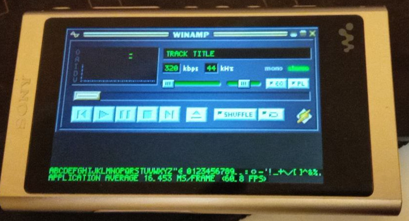

So, C++ GUI client, huh? Just draw text and textures, right?

**Wrong.**

It started with rotation. You see, screen is physically too small in portrait orientation for Winamp, so we want to draw
it in landscape. There are some ImGui issues about rotating
screen, [#3972](https://github.com/ocornut/imgui/issues/3972) in particular, which looks like exactly what we need.
Just modify projection matrix and that would be it, right? Wrong again, some widgets are not drawing anymore, because
ImGui thinks that these are off-screen and culls them. I've spent weeks trying to do it properly using shaders and
eventually settled on removing culling altogether. This is a bad solution which break some parts of settings window, but
it works. Bad user experience, hoping to fix it one day.

OK, done with rotation. Let's move on to touch events. These are produced by touchscreen driver and are compatible with
linux input api. Some edits to window library (GLFW) and it works just like it should. Same with button input.

#### Drawing images


Let's draw something, like a texture from base skin. First of all, winamp skins are zip archives containing bmp files (
or a directory with bmp files), so unzipping comes first. Then you need to read bmp data using `stb` library, which is
conveniently built in ImGui and supports bmp... or is it?

Of course, it doesn't. Winamp's skins were made using a huge variety of techniques. That means that you'll encounter
paletted bmps, 2bit-depth bmps, corrupted bmps, perhaps even non-rgb bmps? Winamp had built-in bmp decoder which somehow
handled all of that, `stb` cannot process any of it. In fact, `base-2.91.wsz` from Skin Museum has `balance.bmp`
corrupted:

```shell
$ file BALANCE.BMP 
BALANCE.BMP: PC bitmap, Windows 3.x format, 68 x 433 x 8, 1 compression, image size 15258, resolution 2834 x 2834 px/m, cbSize 16336, bits offset 1078
$ identify BALANCE.BMP
identify-im6.q16: unexpected end-of-file `BALANCE.BMP': No such file or directory @ error/bmp.c/ReadBMPImage/1444.
```

How does Skin Museum handle that? Most likely your browser takes care of drawing such images.

So… ImageMagick. That's right, ImageMagick just to reliably read some bmps (and, later, jpegs for cassette).

Great, after figuring out how to read/load images with ImageMagick we are ready to load them into GPU memory (which is
shared with main memory btw). Textures are loaded, drawn in proper orientation, but they are too small - resize
required. Here comes another problem: winamp main window is `275` pixels wide and screen
is `800`. `800 / 275 = 2.90909...` meaning that resized bitmap will be not pixel perfect. There is nothing you can do
about it, so some elements may look off if you look close enough. Thankfully, small screen hides those imperfections
unless you look really hard and know where to look. Resize is handled by ImageMagick, so it is not wasted on just
reading bitmaps.

#### Text


Winamp has two modes of rendering text: using bitmap font provided by skin and system-provided font (if chosen by user).
Sounds easy, but, as usual, it is not.

Eventually I settled on NotoSans font (Walkman built-in), since it is also used in cassette animation on Android (or is
it? citation needed). Here comes the problem: ImGui uses font atlas, which is basically a huge texture with all glyphs
you selected. But our device is memory-limited, so it is not possible to include all characters at once. Here comes the
trade-off: user has to select character ranges he wants to see (and not all of them). Chinese characters are not
supported at all, it's a guaranteed OOM.

It could've been avoided by providing exact list of characters that will be used. Obtaining such list is relatively
easy: query local song database for all artists and all titles, get unique characters. Most likely it will be your
alphabet, some punctuation and 10-20 characters from foreign languages. The problem is the query - no idea how to do it
quickly.

Another workaround is to use another framework like Qt - how do they render all these characters without font atlas with
such ease? But at that point it was too late to switch.

Marquee is another horror of mine. As you can see on image above (Winamp 2.95), text simply advances by one character to
the left. It is not simple at all. Winamp does it by rendering all text into texture once and then moving it
by `one character width` (at least this is what I think is happening judging from Winamp code). I decided to do it the
old way - print only part of the string that fits into the window. As I am writing those words, a realisation creeps
in - my implementation is imperfect. In Wampy text would be:

`**  1. 05. Come, sweet death (` without half-cut `M`. Not fixing that.

#### Visualization

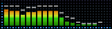

Usually it is made like this: sound data is provided by ALSA, your code reads it, analyzes it
and draws peaks/sound wave/whatever. [Cava](https://github.com/karlstav/cava) is a modern example. There is no easy way
to create specialized sound data output for other applications to read, see [ALSA.md](./ALSA.md). Not happy about that.

Balance slider also comes into this section because it depends on ALSA. Not implemented.

#### Timings


Marquee moves every 200 ms, track time blinks every 1200 ms. I failed to make these intervals perfect, something is
wrong with `std::this_thread::sleep`. Please help.

#### User skins

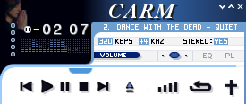

Testing with user skins revealed a lot of issues with element positioning caused by upscaling. Did you know that you can
just cut parts from image atlas, and affected elements will be replaced by transparency? For example, there is no volume
button sprite in skin above. Did you know that `-` (minus sign) in track time display is taken from middle of "2" if
there is no `nums_ex.bmp` file (which came in Winamp 1.91)? These are the parts where ImageMagick steps in again.

I am 100% sure that I didn't cover all edge cases and something is off. Still looks better than most alternatives.

And buttons work just like you expect them to. I couldn't stop pressing buttons during whole day when everything was put
together. It felt so right and neat, you have no idea.

### Cassette


Cassette images come from another Walkman, NW-A100. There is a java firmware
decoder - [link](https://github.com/notcbw/2019_android_walkman/tree/main/nwwmdecrypt). It is written in java, which
always equals to bad user experience (see [java.md](./angry_about/java.md)). Rewrote it in Go,
see [cassetteunpacker](https://github.com/unknown321/cassetteunpacker). Single binary (with a single dependency), it
just works.

Displaying tape + reel images is easy, the hard part is the amount of textures. There are 57 images for each default
reel, and we must load all of them at once. OOM crashes might happen during loading and there is not much I can do.
Perhaps there is some texture compression magic, I just don't know. It works as long as you don't load
tapes/reels too often. Not a good user experience, but hey, it works and looks *pretty*. Personally proud of that.

Originally tape type was chosen by song's codec (meaning that you'll never see some tapes if your library is all mp3s),
so I added `Randomize` option to choose random skin. No idea how it works on Android, maybe there is an option for that
there too. This is an option that fills me with joy. Just take a look at that colorful tape! Here comes another one!
Can't stop changing tracks! L-love it.

### Client misc

<figure>
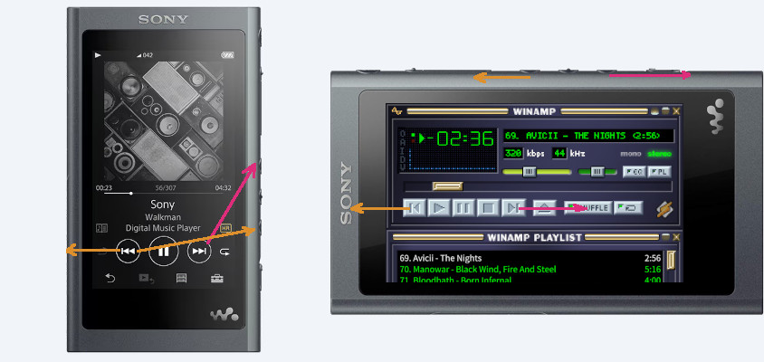
<figcaption>Swapped physical button in wampy to follow buttons' directions on screen.</figcaption>
</figure>

It's kinda hard to explain, but I'll try. Track starts in the leftmost position and moves to the right. Volume starts
from low (vol down) to high (vol up). iRiver T10 follows that principle (see pic in the beginning), could be
partly seen in iPods (no physical track control buttons, only volume cradle), but in Walkmans ignore it.
Physical buttons are on right side, but virtual buttons are off by 90°. `Next` button works out somehow, but `Prev` is
wrong. I know, it sounds weird, but it feels just right in wampy with swapped buttons; they work like they should.

**Clock** finally came back. The reason it was missing in original firmware is simple: there are so many important
indicators and not much space left. You can toggle disabled/hidden ones in GammaRay. Thankfully there is no designer
holding us on, so clock goes to volume text field, right in the middle of the screen where it belongs.

**Huge cover art** was an accidental discovery; you cannot go back after turning it on. Looks very nice, who needs
HR/Lyrics icons anyway? Album name is already on cover most of the time and if you really need it, you can look it up in
detailed info.

There is also a `Disable touchscreen` option which also came as an afterthought. Turn it on, get a non-interactable
screensaver.

### Settings


As you clearly remember, user experience is everything. Everything must be configurable right on the device. No `cfg`
files, no PC connection.

Here comes payback from that ImGui rotation culling hack. Dropdowns (combos) are actually culled windows, but culling is
disabled, so every dropdown shows almost all of its contents. Dropdown orientation (show contents on top or bottom?)
depends on display (or is it window?) height, but our window is bigger (800x800) that actual screen (480x800), therefore
all dropdowns show their content downwards. That breaks tape/reel selection at the bottom of the table.

<figure>
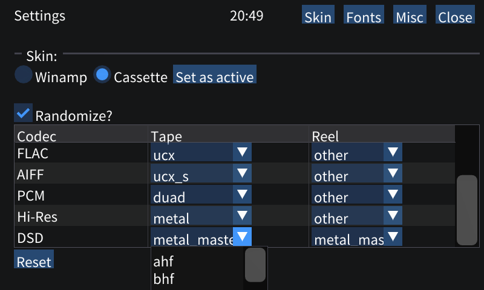
<figcaption>Dropdown dropping in a wrong direction</figcaption>
</figure>

There is also an issue with elements' size. Make them bigger = introduce screen scrolling. This is undesirable with
broken culling. Personally, I am fine with current layout and scaling, but my fingers are not that big.

Displaying loading progress is hard. Why? Because of fonts. On Winamp skin change old fonts' atlases are getting
destroyed and new ones are loaded. But here is the catch - you cannot draw text and remove atlas at the same time.
Another problem is that old textures are getting unloaded too, so if user closes settings during loading, there will be
a black void. Solution? Start loading after current frame end and before next frame starts. That completely stops
drawing and solves technical issues, but does user care about it? Of course no. It could've been nicer (disable "close"
button in settings, stop drawing only when fonts are loaded/unloaded), but there was no time to implement that.

I am happy that there is a user interface for settings, but not so happy about implementation. It needs some work.

### Config file


Unfortunately it is impossible to get rid of user-facing config files in our case. Walkman's software was made with
hardware in mind, meaning that running other software along with it is… unexpected. Wampy can bring device to its knees
during the battle for system resources or even crash if user supplies broken skin file (zip bomb? there is no protection
against that). If that happens with your stock Walkman software, you visit Sony Service Center. But what can user do
with software mod not starting aside from making an issue on GitHub? So here comes `.ini` file with crash loop
protection. Everything from settings is reflected in config file, crash logs are collected into user directory for
easier sharing. Hopefully that'll make post-release maintenance much easier.

### NW-WM1Z / Walkman One compatibility

Walkman One firmware is quite popular. Under the hood it changes some system properties so software is tricked into
changing interface and enabling features to match NW-WM1Z. Since software is mostly compatible with wampy, an effort was
made to add Walkman One build (on that later).

There is no firmware made specifically for NW-WM1Z, because I don't have hardware to test on. Even though software
works, upgrade process may fail in unexpected way and brick the device. If you really want Wampy on your device, please
provide backup file (see [BACKUP.md](./BACKUP.md)).

### Build


All right, code is done, time to build it. As a somewhat regular user I had no experience of actually using CMake aside
from `mkdir build && cd build && cmake .. && make`. Now I have some experience and here are my thoughts.

CMake definitely saves a lot of time (149 readable cmake lines vs 767 in generated makefile) and works fine until it
fails in some weird and unexpected way. For me, it was this:

```shell
set(ENV{PKG_CONFIG_LIBDIR} "${CMAKE_SOURCE_DIR}/libs/ImageMagick/build-${arch}/lib/pkgconfig")
find_package(ImageMagick COMPONENTS MagickCore MagickWand Magick++ REQUIRED)
```

CMake failed to find ImageMagick no matter what unless `pkgconfig` was configured.

First line is something you won't find in `find_package` documentation, you have to figure it out yourself by looking
under the hood and backing off in horror at least two times.

There is also a problem with dependencies not using CMake. In fact, biggest problem for me was
ImageMagick - https://github.com/ImageMagick/ImageMagick/discussions/5102. It's been 3 years, and there is still no
official way of building it using CMake.

Oh, and syntax is a huge improvement from Makefile rules.

#### Cross-compilation

Since Go is my primary language, I got used to `GOARCH=arm GOARM=5 go build .`. That's it, one simple command to
cross-compile whatever you want to compile. Tooling (=user experience) matters.

Not so easy with C++. Walkman uses old libc/libstdc++ versions (2.23 / 6.0.20), meaning that you are locked to C++11
standard and whatever bugs that were there at the time of compilation (unless you provide modern libc with your
application). Therefore, toolchain needed. After some testing (read: a couple of weeks), a working combination was
discovered - see [Dockerfile](https://github.com/unknown321/nw-installer/blob/master/crosstool/Dockerfile).

#### Qt

In order to build server-side Wampy library, Qt build is required, and this is not an easy task. Not only build flags
matter, but you also need pay attention to linking. Steps to build server library:

- build Qt without server code
- build it again with server code

Why? Because our library `libqeglfs.so` uses `QQuickItem/QWhatever` which are available in other Qt libraries; these
libraries are not linked to `libqeglfs.so` during first build because they don't exist yet. Writing qmake rules wasn't
fun at all, sometimes they work, but most of the time they don't.

### Upgrade process


Let's talk about upgrading. On higher level, there are three steps:

- put NW_WM_FW.UPG into root user directory
- set upgrade flag (via scsitool on PC / nvpflag on device)
- reboot device

What happens next:

- First, device boots from small ramdisk, which contains shell, decrypt tool (`fwpchk`) and some regular Linux tools.

- Second, something extracts and runs `install.sh` from firmware upgrade file. I don't know what exactly happens, but
  ultimately it doesn't matter.

- Third, `install.sh` executes. Usually it runs `fwpchk` to decrypt and extract firmware files which could be anything.
  Extracted files are then flashed, copied, moved, removed - you name it.

- Fourth, update flag is reset, so device will boot into regular mode.

Our new installation script:

- decrypt and extract fw file
- copy Wampy files somewhere
- edit init scripts
- reboot

Nope.

The problem is step 3, init scripts. Wampy is supposed to be installed along with other software (scrobbler, Walkman
One); overwriting already existing modifications is not an option.

Init files ([Android init system](https://android.googlesource.com/platform/system/core/+/master/init))
live in [initrd](https://en.wikipedia.org/wiki/Initial_ramdisk), a cpio archive with tools used to load some drivers,
mount filesystems, create block devices - you name it. In order to add new service to init file, you need to make a new
initrd with updated init file. Initrd is then compressed
into Android
Boot Image along with Linux kernel, which is then flashed to one of the partitions.

So here is the plan:

- dump currently used android boot image
- unpack initrd
- update init files, adding new service
- copy Wampy service files
- pack init files back into initrd
- pack initrd+kernel into boot image
- put boot image into firmware upgrade file
- restart and upgrade device with new firmware file using default Sony script

Why two upgrades instead of one? Upgrade scripts provided by Sony are complicated and I don't want to replicate their
functionality. Flashing boot image is their job, not mine.

Well, is that it? Not quite.

At some point my boot images failed to boot, bricking device. Why? Because boot image is not just kernel+initrd, it
has some data between. What data? The answer is at the end of "how does it even boot?" question.

#### Booting


As mentioned before, Walkman NW-A50 is a MediaTek device, which boots like a MediaTek device.

Here are some technical
details: [part 1](http://www.lieberbiber.de/2015/07/02/mediatek-details-soc-startup/), [part2](http://www.lieberbiber.de/2015/07/04/mediatek-details-partitions-and-preloader/),
[part3](http://www.lieberbiber.de/2015/07/05/mediatek-details-little-kernel/).

TL;DR: there is a small program doing pre-boot setup and checks before booting from your boot image. I suppose it copies
N bytes from provided image, where N is taken from that mysterious data. That data is headers in MediaTek header format.
It contains info on image type and its size (maybe more).

There are a couple of Python scripts made for changing that information, but there is no space for Python on the device.
Then there
is [MasterAwesome from XDA](https://xdaforums.com/t/guide-building-mediatek-boot-img-appending-headers.2753788/) with
title of Recognized Developer, 2020 messages and 10856 experience points. He provides `mkimage` binary which does god
knows what; there is no way I run this stuff anywhere without source code (see also: [xda.md](./angry_about/xda.md)).

So [mtkheader](https://github.com/unknown321/mtkheader) was made - open source, single file, works anywhere, does what I
need.

Discovery of MTK headers wasn't instant, so I blamed it on differences between cpio versions on device and PC, where
original initrd was made. So [cpiostrip](https://github.com/unknown321/cpiostrip) was born to make sure that there are
no differences except that one file I changed.

#### Back to upgrading

So here is the full plan:

- dump boot image from block device
- get initrd with `abootimg` from dump
- unpack initrd
- install Wampy files
- add new init service file into initrd
- pack initrd into cpio archive and strip it with `cpiostrip`
- add MTK headers back to initrd with `mtkheader`
- pack initrd back into boot image with `abootimg`
- pack boot image into new firmware upgrade file using `upgtool`
- set upgrade flag, reboot

See implementation: https://github.com/unknown321/nw-installer/blob/master/installer/install.sh

Now our software can be installed along with other software.

Is it over? Not yet.

#### Walkman One compatibility (again)

Walkman One firmware is an odd one. Process of reverting to stock FW:

> Basically, a firmware has its own installer that should be run (just like any other firmware updates) so the device
> can get back to the stock firmware. After running this installer, you should also apply the last official Sony
> firmware update for your player. - Walkman One FAQ.

Simply upgrading with stock NW-A50 firmware doesn't work, why? Because Walkman One was intentionally made incompatible
with *all* other firmwares. Here is how: during install `fwpchk` binary is replaced with patched variant.
What's changed? Encryption key and IV, one byte
off. [Here](https://github.com/unknown321/nw-installer/blob/master/tools/upgtool/w1.patch) is the patch for `upgtool`,
so you can pack/unpack these firmwares.

Why were those keys changed? There is no explanation on Walkman One website, so I assume the good scenario - preventing
user from upgrading modified NW-A50 to stock NW-WM1Z, bricking device in process. Not so nice (but still acceptable)
scenario is protecting source code, which is not available online.

Note: there is a check for ADB and test mode in script, but these are not mentioned in settings file.

If you are curious, Walkman One for NW-A50 (2021-09-22) is 1452 lines of shell script `/sbin/boot_complete.sh`
full of `ifs`. Don't get me wrong, it does its job well, but after like 50 lines shell becomes almost unreadable.

Well, now we support both stock and Walkman One, firmware upgrade files are ready for both platforms. Is it over?

Not yet, there is a last step: installation.

### Installing

#### Windows


Majority of PC users are Windows users. Windows installer **must** be provided for great user experience.

Linux people have their [scsitool](https://www.rockbox.org/wiki/SonyNWDestTool.html) which works well, OSX users will
have to build it themselves, but Windows users are used to `click .exe-> next-> next-> next-> done` installation
process.

All right, what installation technology we have? Requirements are: scriptable, builds on Linux, free. There is
only one answer: [NSIS](https://nsis.sourceforge.io/Main_Page).

##### NSIS


NSIS provides a variety of features; it also proved itself as major pain provider. Everything works fine as long as you
don't need some non-standard feature, like checking for usb drive named "WALKMAN". Nullsoft script language left me
speechless, it feels like a complicated Perl/Awk/Shell script - the moment you stop writing it, you start to rapidly
lose all context. Rest for a day or two and whole script makes zero sense, even though it
works. [Here](https://github.com/unknown321/nw-installer/blob/master/installer/windows/dvdfunc.nsh) is the script that
is used to find "WALKMAN" usb drive. Does it work? Sure. Is it maintainable? NO.

At least it works, builds on Linux and provides required user experience. Tested on Win10.

Finally, we are ready to <del>ship</del> test.

### Testing


Delivering software to user without testing, especially GUI software (see [java.md](./angry_about/java.md)), is an
insult to user.

Start wampy, play music, wait for it to crash. Of course, it crashed.

There was a memory leak on each skin change - not all textures were unloaded.

There was a `std::string`-related segfault somewhere in "update current song/playlist" phase tracing back to libstdc++.
Crash occurred after 4 hours and only on the device, PC version unaffected. Core dump? Useless, corrupted stack;
there are a couple of articles on recovering stack, but ultimately it doesn't matter if it's standard library bug.
It made me rewrite song/playlist from `std::string` to good old `char` arrays with fixed size. Can't wait for first
OOB crash because some song has 1024 bytes in its name
or [some other bullshit](https://dustri.org/b/horrible-edge-cases-to-consider-when-dealing-with-music.html).
I also wrote mockserver (see repo), which replicates some server functionality. It reduced `launch->crash` window from
hours to a couple of minutes. Testing tooling is important too!

Null pointer crashes in server library, because application entered some unexpected state. Unexpected for me of course,
it makes total sense to Sony developer to completely remove header with all icons and info to display "||||" bar for 3
seconds on volume change. There is not much I can do, need more people to test.

GUI elements being off by a couple of pixels or looking unnatural. For faster UI
testing [MPD protocol](https://mpd.readthedocs.io/en/latest/protocol.html) support was added, so if
you really want, you can use it as a desktop MPD client. I don't recommend it - there are weird delays, awkward status
parsing, upscaled version looks bad.

Marquee being off by one symbol, marquee running too fast, marquee crashing the device... Fixed.

ImageMagick not being able to read 2 bit images, unless you force bit depth to 8, then it suddenly works as expected.
ImageMagick refusing to read broken images (like that `BALANCE.BMP`), but if you wrap it in `try-catch`, it produces a
valid image. ImageMagick not reading images from blobs, until you figure out correct action sequence.

Performance issues! Missing config issues! "Can I build it on another machine?" issues! Fun stuff.

### Documentation


Since this is a software mod, user must be aware of complications and "what does this button do"? Wish it could be as
simple as painting a couple of images with happy stickman using the device. Hopefully there is enough information
in [USAGE.md](./USAGE.md).

### Licensing


This is a tough one. Some tools with various licenses are used for building firmware on PC, then other tools are used on
device. Am I allowed to include `abootimg` in FW upgrade file? Is that allowed by license?

Then comes server library entry
point - [link](https://github.com/unknown321/nw-installer/blob/master/server/armv5-unknown-linux-gnueabihf/qeglfshooks_mt8590.cpp).
Most of this file was made by Sony, but there is not much of logic, just empty implementations of already existing
classes. What am I supposed to do, just strip Sony copyright and pretend that this was made entirely by me? Is there a
way of writing same code, but in another way? If Sony legal people are reading this, please help. I want to be friends
with you, not in some legal hellhole because of 90 lines of "do nothing" code.

But what about license of Wampy itself? I want my code to be free to read, but not sold as an exclusive software mod in
some audiophile shop on the other side the world. GPL does not cover these cases, but Commons Clause does. That's why
Wampy is licensed under Commons Clause / GPLv3.

### Publishing code


Wampy was developed locally and pushed to local Gitea instance using git submodules. Why not GitHub from the start? I
like to be in control of my data; also I don't like committing wip code for whole world (and LLMs) to see. For the
majority of development time commits were made at the end of the day with commit message `ok`, meaning that it builds
and works. There were some unwanted files committed, so `.git` grew up to almost a gigabyte. Currently, repo is much,
much cleaner than it used to.

And then it was the time to migrate to GitHub. The idea was to keep code in Gitea, which can mirror code to GitHub
automatically. Yes it can, but without submodules! Submodules are still pointing to local repos, so I'd have to fully
migrate to GitHub. There is no magic allowing you to rewrite submodule url <u>without making a new commit or modifying
existing one</u>. It means that commit history will be different for me on Gitea and everyone else using GitHub. How am
I supposed to troubleshoot then? What about merge requests?

Sorry Gitea, it's not your fault.

---

This is it I guess, software is packaged and ready to ship. This was a story of Wampy, an alternative frontend for
Walkman NW-A50.

See also: rants about [Java](./angry_about/java.md), [C++11](./angry_about/sepples.md), [XDA](./angry_about/xda.md).