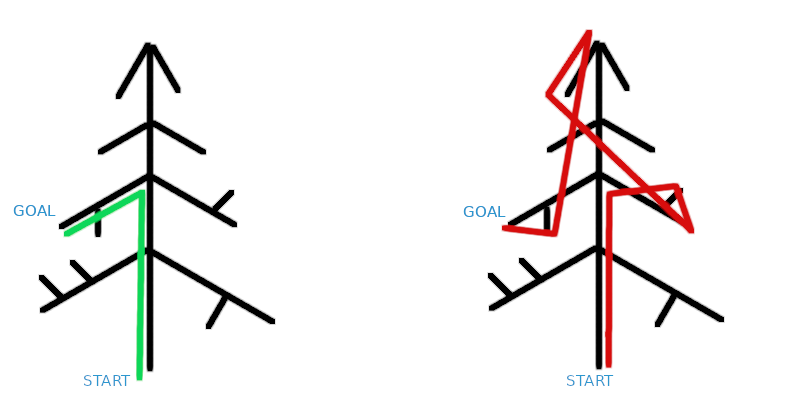

# Making of equalizer settings

The main reason for making this feature is ClearAudio+ producing inconsistent audio. You know, this song sounds amazing
with CA+, but next one is horrible, you take DAP out of your pocket, navigate to sound settings...

This problem was popping on and off for a couple of years. Eventually I settled on "Excited" equalizer preset which
worked fine for most of the time.

Wampy allowed me to get into closer contact with the application and modify its settings programmatically,
so... why not equalizer settings? Sounds like an easy task, grab current song info and audio settings, save them into
database, look in database for saved settings, apply them when needed.

### Getting current song

Wampy was already grabbing song information, but it wasn't enough. Song must be identified by
something unique; `artist - title` pair is not enough. You can have identical files on internal and external storage
with different audio settings, so any info from tags is not accepted. Therefore, only file path can be used as a unique
key. File path is available in "Detailed information" popup, but it is incomplete. Some changes were made; now Wampy
pulls song information directly from Walkman database. Much faster than before, less memory, but it comes with an issue
of concurrent database access. Very rarely you can get a "database error" popup in standard player. Not a big deal, but
still undesirable.

### Saving audio settings

Easy, just save whatever is used into sqlite3 database. SQLite library is already on device (used by standard
player). But where are the values?

### Getting audio settings from player

Previously, Wampy grabbed settings from UI elements (like "detailed info" popup) and Qt view models (which stand between
QML and internal state). This is a working solution, but the amount of code and variables was off the limits - almost 2k
lines of code to get song info and volume (~10 fields). It also involves multithreading, _very_ dependent on current
application state...

On image above you see the primitive scheme of how retrieving info should be (left) and how it actually is (right).
It may also fail at any moment because branch can suddenly snap (user toggled on BT receiver).

Nevertheless, I tried to grab values using old approach, but stopped after discovering that there was no easily
retrievable equalizer band values. So what to do now? Application saves these values itself, where?

### Getting into system framework

Standard player saves all options into nvram using `libConfigurationService`. Parsing nvram is a tedious job; some
values are text and some are numbers; there is no boundaries, just a binary blob. How about using that lib ourselves?
Before developing wampy there was [scrobbler](https://github.com/unknown321/scrobbler), where I tried to get into
service framework to grab info about current song. There even was a working prototype which allowed changing volume.
During [master volume tables development](./MAKING_OF_SOUND_SETTINGS.md) another prototype was developed for
dumping all settings to figure out differences between Walkman One and stock firmware (there were none). That code (with
some modifications) now lives in [./pstserver](https://github.com/unknown321/wampy/tree/master/pstserver) directory. It
dumps all relevant application (`DMP_CONFIG_`) settings on incoming requests.

Why separate application instead of just including it into Wampy? Main reason is that system libraries were compiled
with LLVM (clang) compiler, while Wampy is built by GCC (for an important reason I forgot). You can't mix those,
especially if old compiler versions are used (and they are).

Why service instead of plain run-and-grab-output executable? Don't like that approach, it involves
calling `exec`, `fork`, `system` which are a pain to work with. Service starts once, occupies some memory and that's it.

How are system libraries used without source code? Well, they provide visible (non-hidden) symbols (references to
functions and variables that we can use). To actually use them you need to make a header file with symbols and have that
library file during link stage. You also need to figure out what data types are in there, like
what `pst::services::sound::VptMode` actually is (enum) and what could it be replaced with (struct with int as a
member) (this is where you need to decompile library). After that function can be used if all other conditions are
true.

### Passing info back

All right, `pstserver` is working, data about currently used sound settings is available. How to send it back? There is
an already working mechanism: protobuf data over UNIX socket, which is used to pass data between Wampy and
standard player. This mechanism sucks for tiny `pstserver`, which transfers only 250 bytes of data:

- a lot of generated code (500 lines for a single request with simple struct)
- dependency on libprotobuf (=more memory used)
- client and server must use threads to serve requests

So [shared memory](https://man7.org/linux/man-pages/man7/shm_overview.7.html) is used instead. There is no data transfer
overhead, no pack/unpack stage, it's instant. Same approach was applied to Wampys `GetStatus` method which was called
two times per second. Now Winamp and cassette interfaces are much more responsive, CPU usage is slightly reduced, a lot
of code was removed - a huge improvement.

All right, info about audio settings is here, file path is here. Both are saved into database, how to apply?

### Applying audio settings

Most straightforward solution is to use `pstserver` to write desired configuration back. This is a non-working one.
Standard player is unaware that settings were changed by something else; there is no way to force it to reread full
configuration aside from restarting. That means that there will be no changes in standard player GUI and I see no reason
to make same GUI in Wampy. So... back to that tree with broken branches? Yea, but before `pstserver` I
discovered a shortcut in standard player which opened access to all objects needed to update (only update, these don't
provide values) sound effect settings. Now that code is more or less straightforward and resembles tree on the left.
Fewer branches = faster code.

And that's it, settings are applied.

### Anything else?

You actually can change DC filters (and a couple of other things) on firmwares without dropdown for it in settings, but
there is a problem - there is no GUI for that. Wampy is already suffering from lack of screen space, so I decided to put
it aside for a while.