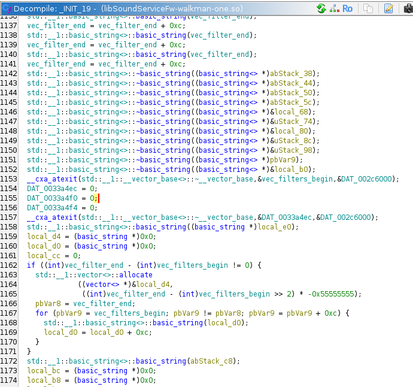

# Making of equalizer and audio filters

Walkman One proved that most sound filters are software-locked and do not depend on hardware; however, you lose some
features when switching from stock to W1 (such as VPT). Personally, I like Tone Control (WM1A/Z), but 6 band EQ sounds
better than 10 band one. What if there is a way to support everything on a single firmware?

Sound makes its way through audio filter chain, which lives in `libSoundServiceFw.so` library. Comparing NW-A50 stock
and WM1Z versions showed some differences in DSEE filter; everything else was more or less the same. If libraries are
the same, the difference between firmwares must be hardcoded in some list of filters; where is it?

Filter list is hardcoded in the same library in one of the initialization functions and looks like this:

This is a big (in decompiled representation) function that reads a lot of strings and shoves them into predefined memory
regions; filter list is represented by `std::vector<std::string>` and is later used by `FilterChain::Create` function.
How to modify that list? Here are the options:

- replace strings by patching the file
- patch initialization function in memory via ptrace
- intercept function using LD_PRELOAD
- modify list later by hooking `Create`

### File patch

In general, file patching sucks. It changes one static list to another static list; it also won't work, because list is
smaller on WM1Z: some of the entries are empty, and you can't replace "empty" in library file. String pointers are taken
from stack, some strings are long gone from stack and impossible to recover.

### Memory patch

Patching initialization function seems like a viable approach. There is a [nice guide][1] available, which looks like
what we need, but there are some problems. Every service on this platform starts via `hagodaemon` binary,
which keeps track of services, makes connections between them and immediately reboots the device if any of the services
is down. Typical service launch command is `hagodaemon SoundServiceFw`, which will start daemon binary, call `dlopen` on
libSoundServiceFw.so, call `SoundServiceFw::OnRun()` function from that library and report status to main
daemon. `Ptrace` is usually used to attach to already running processes; attaching to this one will be complicated. Here
is how it could be done:

- start the program before target (`hagodaemon SoundServiceFw`) starts
- wait for `hagodaemon` to start
- wait for target to `dlopen` library
- attach and inject the code before initialization function runs

There is another problem: initialization function runs during `dlopen` call. `INIT_19` (name generated by decompiler)
is a [constructor function][2] placed into `.init_array` ELF section. All functions from that array are run by `ld` on
[shared library load][3] during `dlopen` call. That involves some tight timings and several "what if" scenarios; most
likely this approach would not work well in our case.

### Intercept init function

You can intercept any exposed function by using `LD_PRELOAD` environment variable ([documentation][4]). This approach
won't work, because `INIT_19` is not exposed.

### Hooking

Last option is to override `FilterChain::Create` function and modify its arguments. This function is exposed, so we can
use `LD_PRELOAD`. List is successfully modified, filters are there, but they don't work.
Logs (`setprop persist.sys.sony.icx.showselog 1`) tell us that `is_proc_` variable for failed filter is set to `false`
by `UpdateProcCond` function every time it runs. Reason is unknown; code differs from filter to filter; most likely that
happens because of some missing initialization step despite `Init()` and `InitEffect()` filter functions running
successfully. Here comes the dirty hack: that value is forcefully set to user-provided value right
after `UpdateProcCond` call. This enables the filter and it works just fine.

Now we can use shared memory to pass config values from `SoundServiceFw` library and control filters
directly which is much faster than using standard player (like it was in "equalizer per song" option). That
does not update player interface, but there is no interface for 6 band and VPT on WM1Z anyway. Setting filter parameters
also change player settings in nvram, which are then picked up by Wampy's "equalizer per song" (very nice).

GUI was made, tests were conducted. Wrong DSEE version (`dseeai` / `dseehxcustom`) crashes sound service, maybe it needs
files from another firmware? Clear Phase refuses to work (guess it needs compatible headphones). ClearAudio+ is not
recognized by some filters on WM1Z, so I disabled it. Just so you know, ClearAudio+ is not a standalone filter, it is an
addon for every filter which supports it. Tone Control can make audio **loud** when combined with other filters. Some
filters like Vinyl Processor have effect so subtle that I was unable to tell if they actually work (they do according to
logs). This is reflected in documentation: please make some measurements before making statements like "it definitely
works, I have perfect hearing even though I work on the airfield".

That's it I guess, filters work everywhere; no need to switch firmwares anymore.

[1]: https://blog.xpnsec.com/linux-process-injection-aka-injecting-into-sshd-for-fun/

[2]: https://gcc.gnu.org/onlinedocs/gcc/Common-Function-Attributes.html#index-constructor-function-attribute

[3]: https://sourceware.org/git/?p=glibc.git;a=blob;f=csu/libc-start.c;h=0350b006fdcc22d2957c2b0df58cdac1c2e29b85;hb=HEAD#l125

[4]: https://man7.org/linux/man-pages/man8/ld.so.8.html