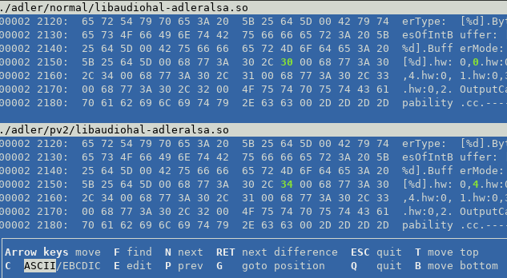
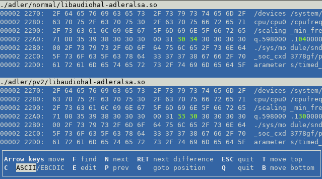
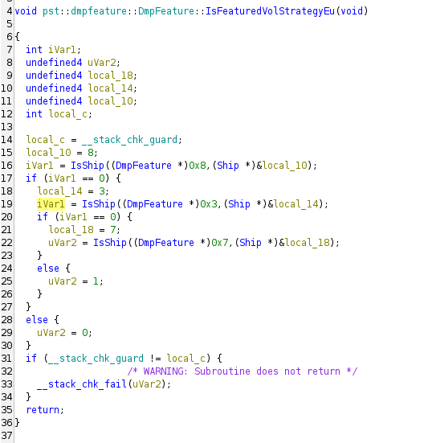

# Making of sound settings

Perhaps it started after reading countless posts discussing how region affects sound signature. Region changes were made
using [SonyNWDestTool][1] in the past and Walkman One in the present. There are almost no fancy volume graphs showing
differences, only vague descriptions like "warmer" and "richer" ([exception][9] - take a good look at last picture
comparing 4 regions). Subjective perception is… subjective; changing region takes time during which your ears can
readjust; device enters energy saving mode after reboot and lowers sound quality; something else? These posts don't look
trustworthy and probably were made by snake oil consumers - that's what I thought.

So let's check out what really happens on NW-A50, stock firmware.

## Boot

### Little kernel

First, device boots little kernel ([details][2]). There is no source available, no logs as well. You can get those by
soldering some wires to board ([like this][3]), but I am not doing that. It makes no sense to modify sound settings in
little kernel, it's purpose to prepare board and boot real kernel. Little kernel is NOT provided in stock firmware, but
you can dump it:

```shell
$ cat /proc/dumchar_info  | grep uboot
uboot        0x0000000000060000   0x0000000002120000   2   /dev/block/mmcblk0p7

$ dd if=/dev/block/mmcblk0p7 of=/contents/p7 
768+0 records in
768+0 records out
393216 bytes transferred in 0.018 secs (21845333 bytes/sec)

$ xxd p7 | head -n 1
00000000: 8816 8858 541c 0400 4c4b 0000 0000 0000  ...XT...LK......
                                                           ^ there it is, little kernel
```

Little kernel provides various variables for real kernel. You can check them in cmdline:

```shell
$ cat /proc/cmdline 
console=/dev/null root=/dev/ram vmalloc=496M slub_max_order=0 slub_debug=O  lcm=1-hx8379c_vdo_cmd fps=6077 vram=6291456 \
androidboot.selinux=disabled bootprof.pl_t=1087 bootprof.lk_t=1217 printk.disable_uart=0 boot_reason=4 \
icx_pm_helper.icx_sysinfo=0x0000001b icx_pm_helper.icx_modelid=0x25000004 icx_pm_helper.icx_ship=0x00000002 \
mmc_core.emmc_boot_serial=0xb6a4e23e icx_pm_helper.icx_boot_option=0 leds_drv.brightness=255 \
androidboot.serialno=10458B75388765 androidboot.bootreason=wdt_by_pass_pwk icx_pm_helper.icx_boot_reason=0x0 \
androidboot.hardware=icx androidboot.console=ttyMT1 androidboot.printk=0 icx_pm_helper.icx_bid2=0 icx_pm_helper.icx_bid3=0 
```

Nothing of interest, let's move on.

### Real kernel

Real kernel is a place of interest. There are [sources available][4], so we can take a look. The part we are looking for
is audio driver. We are using `cxd3778gf` card:

```shell
$ aplay -l
**** List of PLAYBACK Hardware Devices ****
card 0: sonysoccard [sony-soc-card], device 0: cxd3778gf-hires-out DAI_CXD3778GF_DAC-0 []
...                                            ^ there
```

There it is: `./linux/sound/soc/codecs/cxd3778gf`. In `cxd3778gf_table.h/cpp` you can find volume table structures
(which were used later by Wampy) and other information about different audio devices (such as low power output and DSD
output).

There is nothing in driver that indicates sound change during kernel boot.

What happens next? Ramdisc and init.

### Init

NW-A50, just like all other DAPs in these series uses stripped down Android (or could it be "not bloated?"). Basically a
regular Linux with some systems written by Google, like [init][5].

Little kernel boots real kernel, which unpacks ramdisk (initrd.gz) into memory with small set of binaries and init
scripts. At this stage drivers are loaded and configured. Let's take a look into main script, `init.rc`:

```text
74 on fs
75     mount ext4 /emmc@android /system noatime ro
76 
77     start bootanimation
78     exec /system/bin/load_sony_driver_early      <--- nvp nodes
 
178 on boot
179 ... 
212     start load_sony_driver

390 service load_sony_driver /system/bin/load_sony_driver  <--- there you are
391     oneshot
```

bin/load_sony_driver:

```shell
...
mid=`nvpflag -x mid`              # 0x25000004
midupper=`echo $mid | cut -c1-8`  # 0x250000
nvpflag mid $midupper$nvpcap      # 0x25000004, 04 comes from storage size check above, irrelevant

#volume table
PRODDEV=`getprop ro.product.device`  # BBDMP5_linux
shp=`nvpflag -x shp`                 # 0x00000002 0x00000000 (region)
shpfirst=`echo $shp | cut -c1-10`    # 0x00000002 
/system/bin/dacdat auto $PRODDEV $midupper $shpfirst
```

What does it do?

```shell
$ strace -e open /bin/dacdat auto BBDMP5_linux 0x250000 0x00000002
...
open("/system/usr/share/audio_dac/ov_1291.tbl", O_RDONLY) = 3
open("/proc/icx_audio_cxd3778gf_data/ovt", O_RDWR) = 4
open("/system/usr/share/audio_dac/ov_dsd_1291.tbl", O_RDONLY) = 3
open("/proc/icx_audio_cxd3778gf_data/ovt_dsd", O_RDWR) = 4
open("/system/usr/share/audio_dac/tc_1291.tbl", O_RDONLY) = 3
open("/proc/icx_audio_cxd3778gf_data/tct", O_RDWR) = 4
```

Volume tables for NW-A50, region 2, applied.

After that script applies noise cancel tables, limiter tables, gain, ambgain and idata(?). All of those are related to
MDR-NW750N, IER-NW500N and `something 31`. We don't use those, so let's ignore them.

Volume table application changes sound significantly, making it at least louder, you can literally hear it while
switching from `_cew` table to regular one. Could it be the secret empowering people to make those posts about "juice"
and "dryness" in their ears?

It is not, because there is not enough files for all regions:

```shell
$ find /system/usr/share/audio_dac/ -name "*.tbl" | grep -vE "(ncgain|amb)"
/system/usr/share/audio_dac/ov_1291.tbl
/system/usr/share/audio_dac/ov_1291_cew.tbl
/system/usr/share/audio_dac/ov_dsd_1291.tbl
/system/usr/share/audio_dac/ov_dsd_1291_cew.tbl
/system/usr/share/audio_dac/tc_1291.tbl
```

That's it, `ov_1291` table with it's limited variation (`_cew`) plus tone control.

Is there anything else that reads region flag during init? Nope:

```shell
/initrd_unpacked$ grep -r "nvpflag shp"
install_update_script/init_nvp.sh:    nvpflag shp $_SHP_123_ $_SHP_456_

/bin$ grep -r "nvpflag -x shp"
load_sony_driver:shp=`nvpflag -x shp`
load_sony_driver:shp=`nvpflag -x shp`
```

There is nothing else that changes sound at this stage, there is only one region-dependant point of interest and that's
`dacdat` binary. Decompilation showed that there are 5 table variations total and region does not matter. Check out
handy table connecting regions, products and model ids at [./SOUND_SETTINGS.md](./SOUND_SETTINGS.md).

At this point I started adding volume table functionality to Wampy because I had all info to do so, but it there was no
answer to claims by those snake oil consumers. There is also another motive to investigate further: people like to
change and compare regions, so what if we can change regions instantly and hear changes right now instead of rebooting?
That would be the best way to prove that region matters (or not).

Where do we go next at this point? Software is loaded, but what happens next is hard to analyze. There is an easy way
though: Walkman One external tunings.

### Walkman One external tunings

According to Mr.Walkman and Walkman One users, external tunings **do** change signature. Perhaps there is the answer?

Mr.Walkman uses vague explanations on Head-Fi forums and uses same language as others ("warm", "deep"). He also avoids
discussing technical details (for what reason? Afraid to get into nerd discussions? Poor code quality? NPAudio collab
with percentage per every DAP with Walkman One installed?). No matter the reason, he openly suggested someone on forums
to take a look yourself into firmware and that's what we are going to do. Let's compare stock NW1A firmware and Walkman
One NW-A50. That way we could find Mr.Walkman's changes and probably get an explanation.

Comparing root filesystem, ignoring translations and audioanalyzer params (both don't matter):

<details>
<summary>Click</summary>

```shell
$ diff -rq StockRevert/NW_WM_FW/6 NW-A50/walkmanOne/fw/7 2>/dev/null | grep -Ev "(translations|audioanalyzer_params|no such file)" 
Files StockRevert/NW_WM_FW/6/bin/load_sony_driver and NW-A50/walkmanOne/fw/7/bin/load_sony_driver differ
Only in NW-A50/walkmanOne/fw/7/bin: p
Files StockRevert/NW_WM_FW/6/etc/libnfc-nci.conf and NW-A50/walkmanOne/fw/7/etc/libnfc-nci.conf differ
Only in NW-A50/walkmanOne/fw/7/etc: .mod
Files StockRevert/NW_WM_FW/6/lib/libnfc-nci.so and NW-A50/walkmanOne/fw/7/lib/libnfc-nci.so differ
Only in NW-A50/walkmanOne/fw/7/lib: libnfcsequencer.so
Files StockRevert/NW_WM_FW/6/media/bootanimation.zip and NW-A50/walkmanOne/fw/7/media/bootanimation.zip differ
Files StockRevert/NW_WM_FW/6/vendor/sony/bin/HgrmMediaPlayerApp and NW-A50/walkmanOne/fw/7/vendor/sony/bin/HgrmMediaPlayerApp differ
Only in StockRevert/NW_WM_FW/6/vendor/sony/etc/effector_params: ClearPhase_HP_NC31_176400.lps
Only in StockRevert/NW_WM_FW/6/vendor/sony/etc/effector_params: ClearPhase_HP_NC31_192000.lps
Only in StockRevert/NW_WM_FW/6/vendor/sony/etc/effector_params: ClearPhase_HP_NC31_44100.lps
Only in StockRevert/NW_WM_FW/6/vendor/sony/etc/effector_params: ClearPhase_HP_NC31_48000.lps
Only in StockRevert/NW_WM_FW/6/vendor/sony/etc/effector_params: ClearPhase_HP_NC31_88200.lps
Only in StockRevert/NW_WM_FW/6/vendor/sony/etc/effector_params: ClearPhase_HP_NC31_96000.lps
Only in StockRevert/NW_WM_FW/6/vendor/sony/etc/effector_params: ClearPhase_HP_NW500N_176400.lps
Only in StockRevert/NW_WM_FW/6/vendor/sony/etc/effector_params: ClearPhase_HP_NW500N_192000.lps
Only in StockRevert/NW_WM_FW/6/vendor/sony/etc/effector_params: ClearPhase_HP_NW500N_44100.lps
Only in StockRevert/NW_WM_FW/6/vendor/sony/etc/effector_params: ClearPhase_HP_NW500N_48000.lps
Only in StockRevert/NW_WM_FW/6/vendor/sony/etc/effector_params: ClearPhase_HP_NW500N_88200.lps
Only in StockRevert/NW_WM_FW/6/vendor/sony/etc/effector_params: ClearPhase_HP_NW500N_96000.lps
Only in StockRevert/NW_WM_FW/6/vendor/sony/etc/effector_params: ClearPhase_HP_NW750N_176400.lps
Only in StockRevert/NW_WM_FW/6/vendor/sony/etc/effector_params: ClearPhase_HP_NW750N_192000.lps
Only in StockRevert/NW_WM_FW/6/vendor/sony/etc/effector_params: ClearPhase_HP_NW750N_44100.lps
Only in StockRevert/NW_WM_FW/6/vendor/sony/etc/effector_params: ClearPhase_HP_NW750N_48000.lps
Only in StockRevert/NW_WM_FW/6/vendor/sony/etc/effector_params: ClearPhase_HP_NW750N_88200.lps
Only in StockRevert/NW_WM_FW/6/vendor/sony/etc/effector_params: ClearPhase_HP_NW750N_96000.lps
Only in StockRevert/NW_WM_FW/6/vendor/sony/etc/effector_params: DseeAi.bin
Only in StockRevert/NW_WM_FW/6/vendor/sony/etc/effector_params: DseeAi.dcfg
Only in StockRevert/NW_WM_FW/6/vendor/sony/etc/effector_params: DseeAi_HP_ICX1291.bin
Only in StockRevert/NW_WM_FW/6/vendor/sony/etc/effector_params: DseeAi_HP_ICX1291.dcfg
Only in StockRevert/NW_WM_FW/6/vendor/sony/etc/effector_params: DseeAi_HP_ICX1300.bin
Only in StockRevert/NW_WM_FW/6/vendor/sony/etc/effector_params: DseeAi_HP_ICX1300.dcfg
Files StockRevert/NW_WM_FW/6/vendor/sony/etc/effector_params/DseeHxCustom_HP_ICX1278.dcfg and NW-A50/walkmanOne/fw/7/vendor/sony/etc/effector_params/DseeHxCustom_HP_ICX1278.dcfg differ
Only in StockRevert/NW_WM_FW/6/vendor/sony/etc/effector_params: DseeHxCustom_HP_ICX1280.dcfg
Files StockRevert/NW_WM_FW/6/vendor/sony/etc/effector_params/DseeHxCustom_Mode_0.bin and NW-A50/walkmanOne/fw/7/vendor/sony/etc/effector_params/DseeHxCustom_Mode_0.bin differ
```

</details>

ClearPhase can be ignored (no supported headphones), Dsee is ignored too (signature changes even without it). Libnfc is
NFC, doesn't matter. `load_sony_driver` script is stripped of storage size detection and some comments, everything is
the same about `dacdat` and volume tables. `NW-A50/walkmanOne/fw/7/bin/p` is a script that compresses binaries for UPG?
Definitely not audio. `bootanimation.zip` is boot animation, next file. `vendor/sony/bin/HgrmMediaPlayerApp` is the
audio player application, what's changed there? Could it be IT?

Nope, this is not it. Here are the changes:

```shell
hgrmmediaplayerapp diff:
FUN_0036ed60 - ghidra thinks that function is one byte longer
005ebc17 - power off logo
005f7bf2 - qml height, interface adjustments
005f90f5 - qml height
005fc002 - qml string
005fc44c - qml string
005ff559 - qml height
00604888 - qml string
00607568 - qml string
0060e846 - qml string
006106dc - qml string
0061f08e - qml string
```

You can do it using Ghidra binary diff mode or `vbindiff`, whichever you like. The gist is that this file has only
cosmetic adjustments and nothing about sound signatures.

Okay, system files on root partition are not changed. What about `etc/.mod` directory?

```shell
etc/.mod$ find . -type f | grep -Ev "(txt|anls|lang|dll|exe|UPG|xml)"
./adler/normal/libaudiohal-adleralsa.so
./adler/normal_nt/libaudiohal-adleralsa.so
./adler/pv1/libaudiohal-adleralsa.so
./adler/pv2/libaudiohal-adleralsa.so
./gain/gain_l/ov_127x.tbl
./gain/gain_l/ov_127x_cew.tbl
./gain/gain_l/ov_dsd_127x.tbl
./gain/gain_l/ov_dsd_127x_cew.tbl
./gain/gain_n/ov_127x.tbl
./gain/gain_n/ov_127x_cew.tbl
./gain/gain_n/ov_dsd_127x.tbl
./gain/gain_n/ov_dsd_127x_cew.tbl
./conf_a
./conf_b
./conf_c
```

There we are excluding audio analyzer tweaks (which are not applied by default, stock revert files and translation
files). About translation files: these are needed to display "Bright tuning applied" in unit info. That string indicates
that installation script copied translation files, not that tuning was actually applied - there is a difference.

Adler files are plus modes, v1 and v2. They do change sound What's the difference between these and stock?

Walkman One firmware page:

> "Plus v1" - a different flavor of the normal chosen sound signature;
>
> "Plus v2" - usually better than the Plus v1 mode, and it also consumes less battery;

Even though this is optional functionality, let's take a detour.

---




That's it. What do those bytes mean?

Plus v1 changes output hw0:4 (cxd3778gf-icx-lowpower) to hw0:0 (cxd3778gf-hires-out), forcing you through hires
output. It also increases value in `/sys/devices/system/cpu/cpu0/cpufreq/scaling_min_freq`, which increases cpu
frequency on powersave governor. You can read more about it [here][6]. Perhaps it helps to prevent slowing down on low
battery?

Plus v2 changes output hw0:0 (cxd3778gf-hires-out) to hw0:4 (cxd3778gf-icx-lowpower) forcing you to play hires
audio on lowpower interface, thus probably reducing battery consumption. Cpu frequency increase is also applied.

Difference between outputs? Consult kernel driver.

mediatek/mt8590/icx-machine-links.c, line 319 (CONFIG_SND_SOC_ICX_AUDIO_MOBILE_NEXT=y in /proc/config.gz):

<details>
<summary>hires</summary>

```c
    {   
    .name = "CXD3778GF_ICX",
    .stream_name = "cxd3778gf-hires-out",
    .cpu_dai_name = "mt8590-i2s1",
    .platform_name = "mt8590-audio",
    .codec_dai_name = CXD3778GF_DAC_DAI_NAME,
        .dai_fmt = SND_SOC_DAIFMT_I2S
           | SND_SOC_DAIFMT_CBM_CFM
           | SND_SOC_DAIFMT_NB_NF,
    .ops = &stream_icx_slave_ops,
     },

/*
 * For cxd3778gf special seqpuecne
 * slave mode by alsa rate
 */
static int pcm_slave_icx_rate_hw_params(
    struct snd_pcm_substream *substream, struct snd_pcm_hw_params *params)
{
    struct snd_soc_pcm_runtime *rtd = substream->private_data;
    struct snd_soc_dai *codec_dai = rtd->codec_dai;
    struct snd_soc_dai *cpu_dai = rtd->cpu_dai;
    struct mt_stream *s = substream->runtime->private_data;
    /* codec slave, mt8590 master */
    unsigned int fmt = SND_SOC_DAIFMT_I2S | SND_SOC_DAIFMT_CONT;
    unsigned int mclk_rate;
    unsigned int rate = params_rate(params);        /* data rate */
    unsigned int div_mclk_to_bck = rate > 192000 ? 2 : 4;
    unsigned int div_bck_to_lrck = 64;
    pr_debug("%s() rate = %d\n", __func__, rate);

    mclk_rate = rate * div_bck_to_lrck * div_mclk_to_bck;
    /* codec mclk */
    snd_soc_dai_set_sysclk(codec_dai, 0, mclk_rate, SND_SOC_CLOCK_IN);
    /* mt8590 mclk */
    snd_soc_dai_set_sysclk(cpu_dai, 0, mclk_rate, SND_SOC_CLOCK_OUT);
    /* mt8590 bck */
    snd_soc_dai_set_clkdiv(cpu_dai, DIV_ID_MCLK_TO_BCK, div_mclk_to_bck);
    /* mt8590 lrck */
    snd_soc_dai_set_clkdiv(cpu_dai, DIV_ID_BCK_TO_LRCK, div_bck_to_lrck);
    /* mt8590 master */

    fmt |= SND_SOC_DAIFMT_CBM_CFM;
    /* codec master */
    snd_soc_dai_set_fmt(codec_dai, fmt);
    fmt |= SLAVE_USE_ASRC_NO;
    snd_soc_dai_set_fmt(cpu_dai, fmt);
    s->use_i2s_slave_clock = 1;

    return 0;
}
```

</details>

<details>
<summary>lowpower</summary>

```c
    {   
    .name = "CXD3778GF_ICX_lowpower",
    .stream_name = "cxd3778gf-icx-lowpower",
    .cpu_dai_name = "mt8590-i2s1",
    .platform_name = "mt8590-lp-audio",
    .codec_dai_name = CXD3778GF_ICX_DAI_NAME,
        .dai_fmt = SND_SOC_DAIFMT_I2S
           | SND_SOC_DAIFMT_CBM_CFM
           | SND_SOC_DAIFMT_NB_NF,
    .ops = &stream_icx_lp_slave_ops,
     },

/*
 * For cxd3778gf special seqpuecne
 * lp slave mode by alsa rate
 */
static int lp_slave_icx_rate_hw_params(
    struct snd_pcm_substream *substream, struct snd_pcm_hw_params *params)
{
    struct snd_soc_pcm_runtime *rtd = substream->private_data;
    struct snd_soc_dai *codec_dai = rtd->codec_dai;
    struct snd_soc_dai *cpu_dai = rtd->cpu_dai;
    struct mt_lp_private *priv = snd_soc_platform_get_drvdata(rtd->platform);
    /* codec slave, mt8590 master */
    unsigned int fmt = SND_SOC_DAIFMT_I2S | SND_SOC_DAIFMT_CONT;
    unsigned int mclk_rate;
    unsigned int rate = params_rate(params);        /* data rate */
    unsigned int div_mclk_to_bck = rate > 192000 ? 2 : 4;
    unsigned int div_bck_to_lrck = 64;
    pr_debug("%s() rate = %d\n", __func__, rate);

    mclk_rate = rate * div_bck_to_lrck * div_mclk_to_bck;
    /* codec mclk */
    snd_soc_dai_set_sysclk(codec_dai, 0, mclk_rate, SND_SOC_CLOCK_IN);
    /* mt8590 mclk */
    snd_soc_dai_set_sysclk(cpu_dai, 0, mclk_rate, SND_SOC_CLOCK_OUT);
    /* mt8590 bck */
    snd_soc_dai_set_clkdiv(cpu_dai, DIV_ID_MCLK_TO_BCK, div_mclk_to_bck);
    /* mt8590 lrck */
    snd_soc_dai_set_clkdiv(cpu_dai, DIV_ID_BCK_TO_LRCK, div_bck_to_lrck);
    /* mt8590 master */

    fmt |= SND_SOC_DAIFMT_CBM_CFM;
    /* codec master */
    snd_soc_dai_set_fmt(codec_dai, fmt);
    fmt |= SLAVE_USE_ASRC_NO;
    snd_soc_dai_set_fmt(cpu_dai, fmt);
    priv->use_i2s_slave_clock = 1;
#ifdef CONFIG_MTK_CM4_USE_HIGH_FREQ_ASRC
    priv->univpll_keep = 0;
#endif
    return 0;
}
```

</details>

<details>
<summary>diff</summary>

```diff
2,3c2,3
<     .name = "CXD3778GF_ICX",
<     .stream_name = "cxd3778gf-hires-out",
---
>     .name = "CXD3778GF_ICX_lowpower",
>     .stream_name = "cxd3778gf-icx-lowpower",
5,6c5,6
<     .platform_name = "mt8590-audio",
<     .codec_dai_name = CXD3778GF_DAC_DAI_NAME,
---
>     .platform_name = "mt8590-lp-audio",
>     .codec_dai_name = CXD3778GF_ICX_DAI_NAME,
10c10
<     .ops = &stream_icx_slave_ops,
---
>     .ops = &stream_icx_lp_slave_ops,
15c15
<  * slave mode by alsa rate
---
>  * lp slave mode by alsa rate
17c17
< static int pcm_slave_icx_rate_hw_params(
---
> static int lp_slave_icx_rate_hw_params(
23c23
<     struct mt_stream *s = substream->runtime->private_data;
---
>     struct mt_lp_private *priv = snd_soc_platform_get_drvdata(rtd->platform);
48,49c48,51
<     s->use_i2s_slave_clock = 1;
< 
---
>     priv->use_i2s_slave_clock = 1;
> #ifdef CONFIG_MTK_CM4_USE_HIGH_FREQ_ASRC
>     priv->univpll_keep = 0;
> #endif
```

</details>

Hires is cooler I guess. Needs more technical explanation, but ultimately it doesn't matter because plus mode is region
independent; not what we are looking for. These values (cpu, output device) are now shown on
Wampy's `Sound Settings -> Status` page.

---

Back to other files. Gain is master volume tables taken from other firmwares. Consult [uniq.txt][7].

Only `conf_*` files left, what are those? According to the `sbin/boot_complete.sh` script (the heart of Walkman One),
those go into p22 partition, which is called nvp (non-volatile partition):

```shell
$ grep p22 /proc/dumchar_info 
nvp          0x0000000000f00000   0x0000000039e80000   2   /dev/block/mmcblk0p22
```

These files are 15 megabytes each and used for external tuning change. They are quite different inside, different values
at different locations. Perhaps these files contain some magical code, region definitions or...?

Let's take a look at tuning installation steps:

- write conf_a/b/c into nvp partition
- write backed up nvram into nvram partition
- ask user to install tuning from .exe (why not everything on device?)
- installer writes some info into nvram partition
- installer updates uboot partition with new little kernel

It's hard to diff those changes with regular tools, so I tried to do it separately starting with nvp.
First idea was to talk to nvp driver to clarify things. There is `./lib/modules/icx_nvp_emmc.ko` kernel module that
looks just like what we need. Perhaps it has some answers? Usually you can communicate with drivers using ioctl and this
driver is no exception. `icx_nvp_ioctl` has ioctl ids we need (0x40046e00).

<details>
<summary>Code</summary>

```c
#include <fcntl.h>
#include <cstdint>
#include <cstdio>
#include <cstdlib>
#include <sys/ioctl.h>

int main(int argc, char *argv[]) {
    uint32_t ioctl_nr;
    uint32_t ioctl_p1;

    auto fd = open(argv[1], O_RDWR | O_SYNC);
    if (fd < 0) {
        fprintf(stderr, "cannot open %s\n", argv[1]);
        return 1;
    }

    ioctl_nr = strtol(argv[2], nullptr, 0);
    ioctl_p1 = strtol(argv[3], nullptr, 0);
    printf("%u\n", ioctl_nr);
    printf("%s\n",argv[2]);

    ioctl(fd, ioctl_nr, ioctl_p1);
}
```

</details>

Ioctl must be sent to a block device file. Where is it?

```shell
$ cat /proc/icx_nvp
232,93

$ busybox stat /dev/icx_nvp/000
  File: /dev/icx_nvp/000
  Size: 0         	Blocks: 0          IO Block: 4096   character special file
Device: dh/13d	Inode: 2486        Links: 1     Device type: e8,0                 <----- major number 0xe8 == 232
Access: (0660/crw-rw----)  Uid: (  100/  system)   Gid: (  100/ UNKNOWN)
Access: 2025-01-16 07:32:54.000000000
Modify: 2025-01-16 07:32:54.000000000
Change: 2025-01-16 07:32:54.000000000
```

You can consult [The Linux Kernel Module Programming Guide, Chapter 4. Character Device Files][8] for more info.

Using:

```shell
$ /tmp/ioctl /dev/icx_nvp/000 0x40046e00 1
$ dmesg -c
<4>[22021.017475] (0)[1489:ioctl]ZONE INFO
<4>[22021.017502] (0)[1489:ioctl]  Area  0: type=small u-boot parameter
<4>[22021.017515] (0)[1489:ioctl]      Zone  0: node=1 start=0x0 count=0x1 size=4 system information  
<4>[22021.017528] (0)[1489:ioctl]          00: 00000064
<4>[22021.017539] (0)[1489:ioctl]      Zone  1: node=2 start=0x1 count=0x1 size=32 u-boot password     
<4>[22021.017549] (0)[1489:ioctl]          00: 00000060
<4>[22021.017560] (0)[1489:ioctl]      Zone  2: node=3 start=0x2 count=0x1 size=4 firmware update flag
```

Cool, right? Now we know what `/dev/icx_nvp/` nodes are for.

Here is the non-cool way of doing it using `/bin/nvp` which was waiting on device all that time:

```shell
$ /bin/nvp stat node
ok
$ dmesg -c
<4>[22549.164655] (0)[1500:nvp]NODE INFO
<4>[22549.164679] (0)[1500:nvp]  Node: Area Zone Size    Name
<4>[22549.164691] (0)[1500:nvp]     1:    0    0       4 system information  
<4>[22549.164702] (0)[1500:nvp]     2:    0    1      32 u-boot password     
<4>[22549.164713] (0)[1500:nvp]     3:    0    2       4 firmware update flag
<4>[22549.164723] (0)[1500:nvp]     4:    0    3       4 printk flag         
```

Really...? Anyway, all that cool info means nothing without better data identification. Node 36 is named `EMPR 0` and
has 1024 bytes in it, what am I supposed to do with these bytes?

Then I attempted to do it programmatically using hagoromo framework. I've successfully dumped application/device
configuration keys and values from nvp only to discover that they do not change with 2 exceptions.
These exceptions are _configuration_ nodes (not nvp ones), containing model name (group 0, key 4) and serial number (
group 0, key 1).

What about nvram? From what I've gathered, it has some "custom files" inside used to configure device in some cases.
These files are located at `/data/nvram`:

```shell
$ find /data/nvram/ -type f
/data/nvram/AllFile
/data/nvram/AllMap
/data/nvram/APCFG/APRDEB/WIFI
/data/nvram/APCFG/APRDEB/BT_Addr
/data/nvram/APCFG/APRDEB/WIFI_CUSTOM
/data/nvram/APCFG/APRDCL/FILE_VER
/data/nvram/APCFG/APRDCL/AUXADC
/data/nvram/RestoreFlag
```

There is a file map with promising hardcoded names such as `Audio_Effect`, but there is no file data for that name -
failure again? And even if there were some audio-changing bytes, why would you need to use exe later? Conf_a/b/c are
actually nvram files from different devices and involved in transforming your DAP into another model. Perhaps they
change device identification so exe installer could recognize the device? Exe installer then flashes new little kernel
and patches nvp a little (changing those configuration nodes?).

So now you have nvram from DMP-Z1 (for example), little kernel from DMP-Z1 and your configuration nodes say DMP-Z1.
After these manipulations your device is bootable and software believes that your model is actually DMP-Z1. Software
then sets up audio processing just like it would on real hardware, unlocking DseeAi or whatever else.

And there is no _custom_ audio data changes, only swapping files from one device to another.

There are some questions left: how does DMP-1Z even work on lower-end hardware? From what I've gathered, it has its own
Aulos card(?) instead of cxd3778gf used on NW-A50; there are no volume tables and dac tools in its stock firmware. And
where do these little kernels and nvrams used in tunings came from, dumped from devices?

I am 100% sure that I've mixed up some info about nvp and nvram (it was a badly documented process), but overall the
conclusion is this: external tuning is just a device mutating into another, not a handcrafted sound settings bundle.

---

Still, all this info is not related to regions.

Let's sum it up: volume tables depend on regions, but there are only two variations - `_cew` and regular one. During
boot nothing else changed sound signature. Walkman One provides device model changer (external tunings) and juggles
sound outputs (plus mode, adler libs), but only when asked for. Where is that region value handler that makes device
sound different?

It's buried deep in software and split
between `libConfigurationService`, `HgrmMediaPlayerApp`, `libDmpFeature`, `libSoundServiceFW` and maybe other libs.

Here is an example of such check in `libDmpFeature`:



It checks currently set region against 0x8 (MX3), 0x3 (CEW) and 0x7 (TW); if region matches then that strategy is
*probably* applied. Why probably? Software doesn't blindly trust `libDmpFeature` and does additional checks on its own.
For example, `pst::dmpfeature::DmpFeature::IsFeaturedClearAudioPlus` always returns `true` no matter the region and
model; despite that there is no ClearAudio on WM1Z. And even if it's used, *how* is it used? Maybe it spawns a gui popup
with some volume limiting info, maybe not.

These checks are scattered all over the place. Example above decompiled very nicely, but similar
checks in `HgrmMediaPlayerApp` are hard to find and follow through. So... there is no definitive answer for "what
exactly happens to the sound when region changes". There is no huge table with rules saying "region KR3 has 50% more
bass and 36% less treble", only binary code all over the place.

What about Walkman One J123 firmware with added J1/2/3 regions? These regions were actually added, but not to
Walkman software stack - they were added to Walkman One *config script*, ids `0x00000100,0x00000200,0x00000300`. Not a
single significant file was changed, only this script and NPAudio-related stuff. Most likely Mr.Walkman was looking
around some binaries and found these just like I did on that screenshot above. Or perhaps he was bruteforcing
regions?

All that info above may look like an attempt to belittle Mr.Walkman and his contribution to custom firmware scene, but
it is not. In my mind his firmware turned from some black box with unknown inputs into a logically structured piece of
software. It does suffer from lack of GUI, but ultimately it doesn't matter because it still delivers better sound. Yes,
there are no sound tunings made exclusively by him, but putting all this together and spreading over various devices is
a hard job; I respect that. It just happened that he made a sound-changing firmware, and I was curious about inner
workings of it.

At the end the mystery of regions stays unsolved; most people will continue to speak in vague terms without actual data
to back up their opinions. At least this hunt for info made me research volume tables and make an editor for them. By
the way NW-A100 also uses `.tbl` files, different size and structure, but the process should apply to it just like it
does on NW-A50.

[1]: https://www.rockbox.org/wiki/SonyNWDestTool.html

[2]: http://www.lieberbiber.de/2015/07/05/mediatek-details-little-kernel/

[3]: https://4pda.to/forum/index.php?showtopic=535287&st=5260#entry46980943

[4]: https://oss.sony.net/Products/Linux/Audio/NW-A57.html

[5]: https://android.googlesource.com/platform/system/core/+/master/init

[6]: https://wiki.archlinux.org/title/CPU_frequency_scaling#Scaling_governors

[7]: https://github.com/unknown321/wampy/blob/master/tunings/uniq.txt

[8]: https://tldp.org/LDP/lkmpg/2.4/html/x579.html

[9]: https://www.head-fi.org/threads/sony-walkman-custom-firmware-non-android.943661/post-18092878