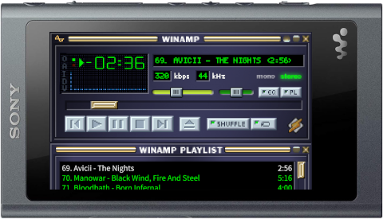
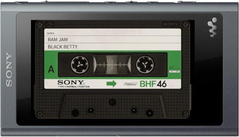

wampy
=====

Alternative frontend for NW-A50 series Walkman player.

Also works on [WalkmanOne (NW-A50)](https://www.mrwalkman.com/p/sony-nw-a50series-custom-firmware.html).

 

## Features:

- Winamp 2 skin support
- Custom cassette skins
- On-the-fly skin change
- Default player enhancements (add clock and increase cover art size)

See [USAGE.md](./USAGE.md).

## Install

### Pre-install

It is strongly recommended to make a backup. See [BACKUP.md](./BACKUP.md).
You should also read [USAGE.md](./USAGE.md) beforehand to get acquainted with quirks and bugs.

### Windows

Download exe from [releases](https://github.com/unknown321/wampy/releases), run and follow instructions.

Device will restart twice.

### Linux/OSX

See [INSTALL.md](./INSTALL.md)

## Build from source

See [BUILD.md](./BUILD.md)