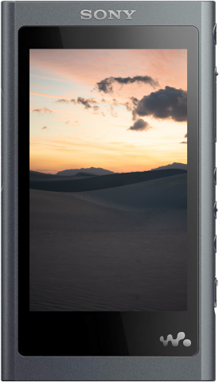
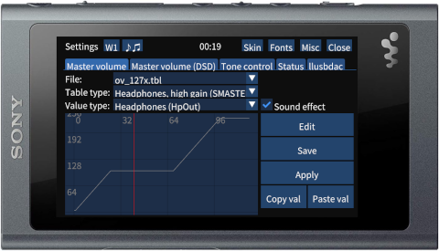
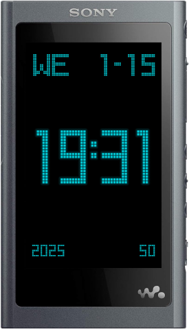

wampy
=====

Interface addon for NW-A50 series Walkman player.

Also works on Walkman One [NW-A50][1]/[A40][2]/[A30][3].

[1]: https://www.mrwalkman.com/p/sony-nw-a50series-custom-firmware.html

[2]: https://www.mrwalkman.com/p/walkman-one-for-nw-a40series.html

[3]: https://www.mrwalkman.com/p/walkman-one-nw-a30series.html

&nbsp;
  

## Features:

- Winamp 2 skin support
- Custom cassette skins
- On-the-fly skin change
- Volume table editor
- Per-song audio options
- Default player enhancements (add clock and increase cover art size)
- Digital clock skin (pretty!)
- [Low latency USB DAC module](https://github.com/zhangboyang/llusbdac)

See [USAGE.md](./USAGE.md).

## Device support

| Device          | Stock | Walkman One | Notes                                                    |
|-----------------|-------|-------------|----------------------------------------------------------|
| NW-A50          | ✅     | ✅           |                                                          |
| NW-A40          | ❌     | ✅           | stock fw is broken, outdated GPU driver; use Walkman One |
| └──[A50 mod][4] | ✅     | ---         | confirmed by community                                   |
| NW-A30          | ❌     | ✅           | stock fw is broken, outdated GPU driver; use Walkman One |
| NW-ZX300        | ?     | ✅           | looking for tester [#12][5]                              |
| NW-WM1A/Z       | ?     | ?           | looking for tester [#13][6]                              |
| DMP-Z1          | ?     | ?           | looking for tester                                       |

[4]: https://www.mrwalkman.com/p/nw-a40-stock-update.html

[5]: https://github.com/unknown321/wampy/issues/12

[6]: https://github.com/unknown321/wampy/issues/13

## Install

### Pre-install

It is recommended to make a backup. See [BACKUP.md](./BACKUP.md).
You should also read [USAGE.md](./USAGE.md) beforehand to get acquainted with quirks and bugs.

### Windows

Download exe from [releases](https://github.com/unknown321/wampy/releases), run and follow instructions.

Device will restart twice.

### Linux/OSX

See [INSTALL.md](./INSTALL.md)

## Build from source

See [BUILD.md](./BUILD.md)

## See also

[Making of](./MAKING_OF.md)

[Making of sound settings](./MAKING_OF_SOUND_SETTINGS.md)

[Making of equalizer](./MAKING_OF_EQUALIZER.md)

[Scrobbler](https://github.com/unknown321/scrobbler)

## Support me

https://boosty.to/unknown321/donate
