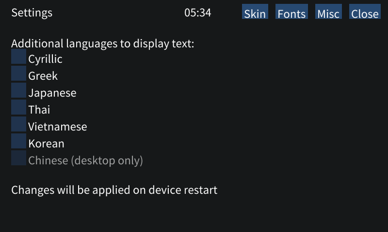

# Table of contents

<!-- TOC -->

* [Table of contents](#table-of-contents)
  * [Usage](#usage)
  * [General issues and troubleshooting (read these)](#general-issues-and-troubleshooting-read-these)
    * [⚠️What to do if device crashes / Wampy doesn't start?⚠️](#what-to-do-if-device-crashes--wampy-doesnt-start)
    * [Wampy is on screen but doesn't respond and cannot be toggled off](#wampy-is-on-screen-but-doesnt-respond-and-cannot-be-toggled-off)
    * [Wampy is not showing when "Hold" is toggled](#wampy-is-not-showing-when-hold-is-toggled)
    * [Wampy is empty](#wampy-is-empty)
    * [Notes on ugly settings](#notes-on-ugly-settings)
    * [Fonts](#fonts)
    * [There is a "detailed info" popup after turning screen off and on instead of Wampy](#there-is-a-detailed-info-popup-after-turning-screen-off-and-on-instead-of-wampy)
    * [Everything lags after changing skins/tapes too much](#everything-lags-after-changing-skinstapes-too-much)
  * [Using Wampy](#using-wampy)
    * [Winamp](#winamp)
      * [UI Buttons](#ui-buttons)
      * [Settings screen](#settings-screen)
      * [Known issues and quirks](#known-issues-and-quirks)
    * [Cassette](#cassette)
      * [Settings](#settings)
      * [Issues and quirks](#issues-and-quirks)
    * [Custom skins](#custom-skins)
      * [Winamp skins](#winamp-skins)
      * [Cassette skins](#cassette-skins)
  * [Misc](#misc)
    * [Issues](#issues)
  * [Providing debug information](#providing-debug-information)

<!-- TOC -->

## Usage

Use "Hold" toggle to enable/disable wampy.


While wampy is running, default locking functionality is disabled - buttons and touchscreen are working.

Holding volume button to rapidly change volume doesn't work. Volume is changed per button press in 1% intervals (~2
points in default player terms).

## General issues and troubleshooting (read these)

### ⚠️What to do if device crashes / Wampy doesn't start?⚠️

If Wampy failed to start 3 times (read: device rebooted trice), it stops starting until you edit `wampy/config.ini`.
Remove config file or set `[wampy][badboots]` to 0 (along with device-breaking settings you changed such as fonts) and
reboot the device. If you cannot access config file (device stuck in boot loop and won't connect to pc, very unlikely
situation), restore it from backup that you made beforehand (see [BACKUP.md](./BACKUP.md)).

### Wampy is on screen but doesn't respond and cannot be toggled off

Reboot device by holding power button.

### Wampy is not showing when "Hold" is toggled

If that happens right after device boots, Wampy might be still loading (see [Cassette quirks](#issues-and-quirks)). Wait
for a minute.

Otherwise, it might've crashed.

### Wampy is empty

Try toggling it on and off again. Perhaps device is connected to PC in Mass Storage mode?

### Notes on ugly settings

Due to unfortunate combination of font and framework quirks, all text in settings is placed slightly lower than
expected.

Rotation is not handled very well by framework, drawing backend and repo owner, so dropdowns are broken.
See https://github.com/ocornut/imgui/issues/7866 and [libs/imgui.patch](./libs/imgui.patch).

### Fonts

By default, basic latin characters plus various punctuation are used. If your songs have non-latin glyphs in their
artist/title fields, you'll have to toggle on needed character set.

⚠️**WARNING**⚠️

Due to gui framework limitations all characters are loaded into huge texture (font atlas) which is then uploaded to GPU
memory. GPU memory is shared with main memory and usually there is not much left. If you turn on all character sets,
this **will** cause crashes. Generally it is fine to turn on one or two of these. Chinese characters are guaranteed to
crash your device, so they are explicitly disabled.

If crashes occur, see
to [What to do if device crashes / Wampy doesn't start?](#what-to-do-if-device-crashes--Wampy-doesnt-start) section.



### There is a "detailed info" popup after turning screen off and on instead of Wampy

This is the place where current track info is coming from. Toggle Wampy on and off to close it automatically or just
close it by hand.

Why does it happen? Default player restores itself on power on and there is no indication of it being ready to be hidden
again. Hiding default player as soon as possible caused crashes, so... Sorry about that.

### Everything lags after changing skins/tapes too much

Reboot the device. I suppose that happens because of opengl texture unloading (or a memory leak:).

## Using Wampy

Wampy works with default music player.

Wampy does not work with:

- Language study
- SensMe
- Radio

### Winamp

All buttons and sliders work just like you expect them to (except EQ, repeat, playlist, and balance slider, see below).

Not implemented:

- Visualization: technical reasons. See [alsa.md](alsa.md).
- Title scrolling by touching: framework limitations/lack of knowledge
- Scrolling playlist (backend doesn't provide enough data)
- Editing playlist, not possible with current default player integration level
- Playlist bottom buttons (which do nothing, because playlist is not editable)
- `regions.txt`, which allows making parts of skin transparent. Some skins may look bad (ex. Dremples.wsz).
- Easter eggs (not important)

#### UI Buttons

EQ button does nothing because mapping EQ window to default player EQ is not an easy task.

Repeat button has 3 states: on, repeat 1 and off. Winamp doesn't have "repeat 1" sprite, so "on" sprite is reused.

Playlist button shows playlist in full screen. Touch top right corner to return. You cannot fully hide playlist.

Balance slider does nothing for two reasons. First, integrating it with player sound subsystem is not that easy. Second,
it's too small to make exact adjustments with finger.

#### Settings screen

Press `Eject` button to open settings.


Use dropdown and "Load skin" button to change skin. Upload new skins to `wampy/skins/winamp/` directory on your device.
You can get skins from [Winamp Skin Museum](https://skins.webamp.org/).

`Bitmap font in playlist` sometimes looks cool, consider this a feature.

`Prefer time remaining` changes track time to negative on application start.

`Show clutterbar` displays vertical list of options to the left of track time/visualization.

#### Known issues and quirks

Issues:

- Tapping position bar doesn't work sometimes
- Playlist flickers sometimes
- Track time and title marquee tick in uneven intervals

Quirks:

- Playlist is never full. Default player keeps up to 15 songs in memory, some of those have already been played,
  reducing playlist size further
- Some elements may look slightly off (if you look hard enough) due to upscaling (800/275 = 2.90909...).
- There might be small delay between clicking button and getting response (noticeable on shuffle button)

Improvements (compared to Winamp v2.95):

- Bitrate stays the same even if it changes (VBR tracks) (backend provides static bitrate)
- UTF8 support:
  - playlist entries always show artist-title info from tags
  - marquee works with non-ascii characters (see [image](./images/wampy-good-utf.png))

### Cassette

On Walkman's 40th Anniversary in 2019, newer models on Android got cassette tapes as a lockscreen animation
(see [video](https://www.youtube.com/watch?v=oQ4WlkU6dgY)).
Pure Linux players were left behind, but not anymore.

#### Settings

Press top right corner to open settings.


You can combine any tape with any reel. Default tapes and reels are taken from Android application. See
also: [cassette-to-format.png](./images/cassette-to-format.png).

You can provide your own tapes and reels. Put them into `wampy/skins/cassette/tape` and `wampy/skins/cassette/reel`
respectfully (see [Custom skins](#custom-skins) for `test_reel` and `test_tape`).

Use `Randomize?` checkbox to choose random codec on track change instead of strict matching. *Note*: this will NOT mix
tapes with reels. Your FLAC song may get `ahf+other` combination (MP3 256), but not `cc_gelb+chf` combination (not
present in table).

After changing tape/reel to some new entry not used before, selected entry will be loaded which takes some time. There
is no visual indication.

#### Issues and quirks

Issues:

- Dropdowns and tables in settings are broken, so not all values are selectable for `DSD` and `Hi-Res`.
- Default reels have a lot of textures, which may negatively impact performance. Sometimes reboot is required after
  changing settings.
- Changing active skin to cassette may crash device if there is not enough memory at the moment.

Quirks:

- Default reels and tapes load for quite some time (at least 70 seconds). Wampy is not available during loading and
  there is no indication of loading. Default player loads faster than that, so there is a period of time when user
  expects everything to work, but it is not possible yet.

### Custom skins

Device directory tree:

```shell
LEARNING/
MUSIC/
wampy/
├── config.ini
└── skins
    ├── cassette
    │   ├── reel
    │   │   └── test_reel
    │   │       ├── ic_audio_play_tape_reel_other_32.jpg
    │   │       └── ic_audio_play_tape_reel_other_33.jpg
    │   └── tape
    │       ├── ccc
    │       │   └── c.jpg
    │       └── test_tape
    │           ├── cas.jpg
    │           └── config.txt
    └── winamp
        ├── Winamp3_Classified_v5.5.wsz
        ├── Winamp5_Classified_v5.5.wsz
        └── windows98.wsz
```

Winamp has 3 custom skins, cassette has one custom reel with 2 frames and two tapes. Tape `ccc` uses default config.

You can put `wampy` directory on device (*not* SD card). As for now, skin list is updated after device
restart.

#### Winamp skins

Get skins with `.wsz` extension, drop into folder, restart device to refresh list. Grab skins
from [Winamp Skin Museum](https://skins.webamp.org/)
or [make one yourself](https://github.com/WACUP/Winamp-Skinning-Archive/tree/master/Classic%20Skins).

#### Cassette skins

Tape format: JPEG, 800x480 to cover whole screen, any name, `.jpg` extension. Only first found file in directory is
used. You can get some nice tapes from http://tapedeck.org/, non-transparent ones work well with `other` reel.

Reel format: JPEG, any size, any name. All found files in directory are used. Position is defined by tape
in `config.txt`.

`config.txt`:

```yaml
reel: other           # default reel
artistx: 83.0         # track artist coordinates
artisty: 82.0
titlex: 83.0          # track title coordinates
titley: 117.0
reelx: 134.0          # reel upper left coordinate
reely: 160.0
titlewidth: 600.0     # max title width in pixels, title will be cut after that value
textcolor: #000000    # text color, RGB
```

Remember, `(0,0)` is top left corner.

Set `artistx`/`titlex` to negative value to hide artist/title labels.

Config file is not required; default one (with values above) will be used instead.

⚠️**WARNING**⚠️

GPU memory is shared with main memory and usually there is not much left. Putting huge images as tapes/reels
is a **bad** idea. Too many reel textures is bad too.
Consult [What to do if device crashes / Wampy doesn't start?](#what-to-do-if-device-crashes--Wampy-doesnt-start)
section.

## Misc


`Swap prev/next buttons` swaps prev/next buttons when Wampy is on to match Winamp track buttons.

`Huge cover art` changes cover art resolution in default player to 480x480. It also changes title field
to `<artist> - <title>`.

`Show time` adds current time to volume indicator. Time updates every 10 seconds, 24 hours format. Disabled on
Walkman One due to interface clutter.

`Limit max volume` limits max volume to 63 in Wampy, so you can use whole volume slider without going deaf.

`Disable touchscreen` disables touchscreen on next Wampy toggle. To temporarily enable touchscreen in Wampy while in
this mode, set volume to 120 in default player app and toggle Wampy on.

`Debug` checkbox enables some logging, which you (the user) don't need. It also shows codec/bitrate when active skin is
cassette.

`Limit fps`, target fps = 24 . Does it really help to save battery/improve performance? Don't know, off by default.
Applied after restart.

<figure>

<figcaption>"Huge cover art" and "show time" options</figcaption>
</figure>

### Issues

- `Huge cover art` and `Show time` are NOT applied on application start. You need to toggle Wampy once for these to
  apply.
- `Huge cover art` hides lyrics icon.

## Providing debug information

Wampy automatically collects crash dumps and logs on start. These are located in `wampy/log/` directory. Feel free to
delete them if you need space. Usually these indicate that *something* crashed (might be some system service).

You can generate a log when Wampy is running. Enable `Settings->Misc->Debug`, tap "Create log file" at the bottom.
Log will be placed in `wampy/log/log.user.<date>`.