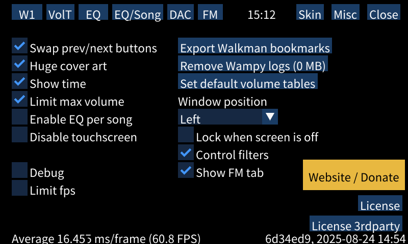

<!-- TOC -->

* [Usage](#usage)
* [General issues and troubleshooting (read these)](#general-issues-and-troubleshooting-read-these)
  * [⚠️What to do if device crashes / Wampy doesn't start?⚠️](#what-to-do-if-device-crashes--wampy-doesnt-start)
  * [Wampy is on screen but doesn't respond and cannot be toggled off](#wampy-is-on-screen-but-doesnt-respond-and-cannot-be-toggled-off)
  * [Wampy is not showing when "Hold" is toggled](#wampy-is-not-showing-when-hold-is-toggled)
  * [There is no song info](#there-is-no-song-info)
  * [Notes on ugly settings](#notes-on-ugly-settings)
  * [Everything lags after changing skins/tapes too much](#everything-lags-after-changing-skinstapes-too-much)
  * [Some buttons are not pressed after a single tap](#some-buttons-are-not-pressed-after-a-single-tap)
  * [Some characters are missing](#some-characters-are-missing)
* [Using Wampy](#using-wampy)
  * [Winamp](#winamp)
    * [UI Buttons](#ui-buttons)
    * [Settings screen](#settings-screen)
    * [Known issues and quirks](#known-issues-and-quirks)
  * [Cassette](#cassette)
    * [Settings](#settings)
    * [Issues and quirks](#issues-and-quirks)
  * [Digital clock](#digital-clock)
    * [Settings](#settings-1)
  * [Custom skins](#custom-skins)
    * [Winamp skins](#winamp-skins)
    * [Cassette skins](#cassette-skins)
    * [Cassette skins, advanced](#cassette-skins-advanced)
* [Misc](#misc)
  * [Issues](#issues)
* [Walkman One](#walkman-one)
  * [Stock firmware](#stock-firmware)
* [Sound settings, Low-latency USB DAC (♪♫ button)](#sound-settings-low-latency-usb-dac--button)
* [Equalizer settings (EQ button)](#equalizer-settings-eq-button)
* [Providing debug information](#providing-debug-information)

<!-- TOC -->

## Usage

Use "Hold" toggle to enable/disable wampy.


While wampy is running, default locking functionality is disabled - buttons and touchscreen are working.

Holding volume button to rapidly change volume doesn't work. Volume is changed per button press in 1% intervals (~2
points in default player terms).

## General issues and troubleshooting (read these)

### ⚠️What to do if device crashes / Wampy doesn't start?⚠️

If Wampy failed to start 3 times in a row, it stops starting until you edit `wampy/config.ini`.
Remove config file or set `[wampy][badboots]` to 0 (along with possible device-breaking settings) and
reboot the device. If you cannot access config file (device stuck in boot loop and won't connect to pc, very unlikely
situation), restore it from backup that you made beforehand (see [BACKUP.md](./BACKUP.md)).

### Wampy is on screen but doesn't respond and cannot be toggled off

Reboot device by holding power button.

### Wampy is not showing when "Hold" is toggled

If that happens right after device boots, Wampy might be still loading (see [Cassette quirks](#issues-and-quirks)). Wait
for a minute.

Otherwise, it might've crashed. Check for logs in `wampy/logs` directory on internal storage; [report the
issue](https://github.com/unknown321/wampy/issues).

### There is no song info

Try toggling it on and off again. Perhaps device is connected to PC in Mass Storage mode? Make sure you are using
default music player, not SensMe or Language Study.

### Notes on ugly settings

Due to unfortunate combination of font and framework quirks, all text in settings is placed slightly lower than
expected.

### Everything lags after changing skins/tapes too much

Reboot the device. I suppose that happens because of opengl texture unloading (or a memory leak:).

### Some buttons are not pressed after a single tap

Tap that button twice. This is a rarely encountered bug, please report if you encounter it frequently.

### Some characters are missing

Wampy is limited to one font due to framework specifics. If some characters are replaced with `?`, you can provide
custom font file, overriding the default one. File must be named `font.tff` (or `font.otf`) and put
into `internal storage/wampy/fonts/` directory. Supported formats: `.ttf`, `.otf`. Changes are applied after reboot.
Invalid font files will crash Wampy; there will be no graphical indication.

You can get font files with other character sets from https://fonts.google.com/noto. Default is `NotoSansKR-Regular`.

## Using Wampy

Wampy works with default music player.

Wampy does not work with:

- Language study
- SensMe
- Radio

### Winamp

All buttons and sliders work just like you expect them to (except EQ, repeat, playlist, and balance slider, see below).

Not implemented:

- Visualization: technical reasons. See [ALSA.md](./ALSA.md).
- Title scrolling by dragging it with cursor/finger: framework limitations/lack of knowledge
- Scrolling playlist (backend doesn't provide enough data)
- Editing playlist, not possible with current default player integration level
- Playlist bottom buttons (which do nothing, because playlist is not editable)
- Easter eggs (not important)

#### UI Buttons

EQ button sends you to Equalizer settings page.

Repeat button has 3 states: on, repeat 1 and off. Winamp doesn't have "repeat 1" sprite, so "on" sprite is reused.

Playlist button shows playlist in full screen. Touch top right corner to return. You cannot fully hide playlist.

Balance slider does nothing for two reasons. First, integrating it with player sound subsystem is not that easy. Second,
it's too small to make exact adjustments with finger.

#### Settings screen

Press `Eject` button to open settings.


Use dropdown and "Load skin" button to change skin. Upload new skins to `wampy/skins/winamp/` directory on your device
(internal storage only). You can get skins from [Winamp Skin Museum](https://skins.webamp.org/).

`Bitmap font in playlist` sometimes looks cool, consider this a feature.

`Prefer time remaining` changes track time to negative on application start.

`Show clutterbar` displays vertical list of options to the left of track time/visualization.

`Skin transparency` enables skin transparency (`region.txt`). Background color is black.

#### Known issues and quirks

Issues:

- Tapping position bar doesn't work sometimes
- Track time and title marquee tick in uneven intervals

Quirks:

- Playlist is never full. Default player keeps up to 15 songs in memory, some of those have already been played,
  reducing playlist size further
- Some elements may look slightly off (if you look hard enough) due to upscaling (800/275 = 2.90909...).
- Skin transparency is not pixel perfect (irrational upscaling ratio).
- There might be small delay between clicking button and getting response (noticeable on shuffle button)

Improvements (compared to Winamp v2.95):

- Bitrate stays the same even if it changes (VBR tracks) (backend provides static bitrate)
- UTF8 support:
  - playlist entries always show artist-title info from tags
  - marquee works with non-ascii characters (see [image](./images/wampy-good-utf.png))

### Cassette

On Walkman's 40th Anniversary in 2019, newer models on Android got cassette tapes as a lockscreen animation
(see [video](https://www.youtube.com/watch?v=oQ4WlkU6dgY)).
Pure Linux players were left behind, but not anymore.

#### Settings

Press top right corner to open settings.


You can combine any tape with any reel. Default tapes and reels are taken from Android application. See
also: [cassette-to-format.png](./images/cassette-to-format.png).

You can provide your own tapes and reels. Put them into `wampy/skins/cassette/tape` and `wampy/skins/cassette/reel`
respectfully (see [Custom skins](#custom-skins) for `test_reel` and `test_tape`) (internal storage only).

Use `Randomize?` checkbox to choose random codec on track change instead of strict matching. *Note*: this will NOT mix
tapes with reels. Your FLAC song may get `ahf+other` combination (MP3 256), but not `cc_gelb+chf` combination (not
present in table).

After changing tape/reel to some new entry not used before, selected entry will be loaded which takes some time. There
is no visual indication.

Tap middle of the screen while in `Randomize?` mode to change current tape/reel.

#### Issues and quirks

Issues: none?

Quirks: none?

### Digital clock

Port of iPod Nano 7g digital clock. Custom skins are not supported.

#### Settings

Touch bottom right corner to open settings.


Select color from dropdown, wait for it to load.

### Custom skins

Device directory tree:

```shell
LEARNING/
MUSIC/
wampy/
├── config.ini
└── skins
    ├── cassette
    │   ├── reel
    │   │   └── test_reel
    │   │       ├── ic_audio_play_tape_reel_other_32.jpg
    │   │       └── ic_audio_play_tape_reel_other_33.jpg
    │   └── tape
    │       ├── ccc
    │       │   └── c.jpg
    │       └── test_tape
    │           ├── cas.jpg
    │           └── config.txt
    └── winamp
        ├── Winamp3_Classified_v5.5.wsz
        ├── Winamp5_Classified_v5.5.wsz
        └── windows98.wsz
```

Winamp has 3 custom skins, cassette has one custom reel with 2 frames and two tapes. Tape `ccc` uses default config.

`wampy` directory is automatically created on internal storage (*not* SD card).

#### Winamp skins

Get skins with `.wsz` extension, drop into folder. Grab skins from [Winamp Skin Museum](https://skins.webamp.org/)
or [make one yourself](https://github.com/WACUP/Winamp-Skinning-Archive/tree/master/Classic%20Skins).

#### Cassette skins

Tape format: JPEG, 800x480 to cover whole screen, any name, `.jpg` extension. Only first found file in directory is
used. You can get some nice tapes from http://tapedeck.org/, non-transparent ones work well with `other` reel.

Reel format: JPEG, any size, any name. All found files in directory are used. Position is defined by tape
in `config.txt`.

Reel sprite changes every 55 ms. Default reels have 57 images each.

`config.txt` contents:

```yaml
# default reel
reel: other
# track artist coordinates
artistx: 83.0
artisty: 82.0
# artist format string
artistformat: $ARTIST
# track title coordinates
titlex: 83.0
titley: 117.0
# track format string
titleformat: $TITLE
# album coordinates, hidden
albumx: -1.0
albumy: -1.0
# album format string
albumformat: $ALBUM
# reel upper left coordinate
reelx: 134.0
reely: 160.0
# max line width in pixels, title, album and artist will be cut after that value
titlewidth: 600.0
# zero-padded minutes and zero-padded seconds separated by colon
durationformat: %1$02d:%2$02d
# text color, RGB
textcolor: #000000
```

Remember, `(0,0)` is top left corner.

Set `artistx`/`titlex`/`albumx` to negative value to hide artist/title/album labels.

Format variables:

- `$title` / `$TITLE`
- `$artist` / `$ARTIST`
- `$album` / `$ALBUM`
- `$year`
- `$track`
- `$duration`

Format options may be omitted; default values will take their place instead.

Duration format
follows [printf syntax](https://man7.org/linux/man-pages/man3/fprintf.3.html), `Format of the format string` section.
Default value `%1$02d:%2$02d` prints duration in `mm:ss` format. Arguments: minute, second, hour.
Example: `%3$01d:%1$02d:%2$02d` will print `2:06:37` for track 2 hours, 06 minutes, 37 seconds long.

Config file is not required; default one (with values above) will be used instead.

Example [tape](./images/ic_audio_play_cassette_ahf_picture.jpg), [reel](./images/ic_audio_play_tape_reel_other_00.jpg).

⚠️**WARNING**⚠️

GPU memory is shared with main memory and usually there is not much left. Using huge images as tapes/reels
is a **bad** idea. Too many reel textures is bad too.
Consult [What to do if device crashes / Wampy doesn't start?](#what-to-do-if-device-crashes--Wampy-doesnt-start)
section.

Alternatively, see advanced section below.

#### Cassette skins, advanced

JPEG-based skins are very slow to load and take a lot of memory. You should use compressed textures (ETC1, `.pkm`
extension) and atlases.

File naming:

```text
wampy/
├── config.ini
└── skins
    ├── reels
    │   └── awesomeReel
    │       ├── atlas.pkm
    │       ├── atlas.txt
    │       └── config.txt
    └── tapes
        └── myCoolTape
            ├── config.txt
            └── tape.pkm
```

ETC1 textures are produced from PNG by etc1tool - [Windows][1], [Mac][2], [Linux][3]

[1]: https://dl.google.com/android/repository/platform-tools-latest-windows.zip

[2]: https://dl.google.com/android/repository/platform-tools-latest-darwin.zip

[3]: https://dl.google.com/android/repository/platform-tools-latest-linux.zip

Atlas contains all the reel images. Maximum resolution: 4096x4096.

Creating atlas, Linux, ImageMagick installed:

```shell
# 4-column atlas with all reel images
montage -mode concatenate -tile 4x reel_source_dir/*.jpg reel_source_dir/atlas.png
# create reel_source_dir/atlas.pkm
etc1tool reel_source_dir/atlas.png
```

After creating pkm file you need to produce `atlas.txt`. This file contains coordinates for your reel tiles.

Format:

```text
<x> <y> <width> <height>
```

Example:

[Atlas image](./images/example-atlas.jpg)

`atlas.txt`:

```text
0 0 528 116
528 0 528 116
1056 0 528 116
1584 0 528 116
0 116 528 116
```

Compressed atlases support configurable animation delay. Put `config.txt` along with atlas files.

Contents:

```text
delayMS: 100
```

## Misc



`Swap prev/next buttons` swaps prev/next buttons when Wampy is on to match Winamp track button directions.

`Huge cover art` changes cover art resolution in default player to 480x480 (max width). It also changes title field
to `<artist> - <title>`.

`Show time` adds current time to volume indicator. Time updates every 10 seconds, 24 hours format. Disabled on
Walkman One due to interface clutter.

`Limit max volume` limits max volume to 63 in Wampy, so you can use whole Winamp volume slider without going deaf.

`Enable EQ per song` toggles dynamic equalizer option. You can read more about it [here](./EQUALIZER_SETTINGS.md).

`Disable touchscreen` disables touchscreen on next Wampy toggle. To temporarily enable touchscreen in Wampy while in
this mode, set volume to 120 in default player app and toggle Wampy on.

`Export bookmarks` button saves bookmark files to `wampy/bookmarks/` directory.

`Remove wampy logs` button removes logs from `wampy/log/` directory.

`DB char count` shows amount of unique characters in your database, which impacts loading time.

`Debug` checkbox enables some logging, which you (the user) don't need. It also shows codec/bitrate when active skin is
cassette.

`Limit fps`, target fps = 24. Does it really help to save battery/improve performance? Don't know, off by default.
Applied after restart.

`Website / Donate` is the most important button with links to GitHub and donation page.

<figure>

<figcaption>"Huge cover art" and "show time" options</figcaption>
</figure>

### Issues

- `Huge cover art` and `Show time` are NOT applied on application start. You need to toggle Wampy once for these to
  apply.
- `Huge cover art` hides lyrics icon.

## Walkman One

<figure>

<figcaption>Walkman One settings</figcaption>
</figure>

User interface for Walkman One firmware. Follow instructions in `CFW/settings.txt` file.

Sound signature is applied on device without PC connection. `CFW/External_Tunings` directory **must** be present.

### Stock firmware

<figure>

<figcaption>W1 settings on stock firmware</figcaption>
</figure>

On stock firmware there is only one option: UI color change.

## Sound settings, Low-latency USB DAC (♪♫ button)

See [SOUND_SETTINGS.md](./SOUND_SETTINGS.md)

## Equalizer settings (EQ button)

See [EQUALIZER_SETTINGS.md](./EQUALIZER_SETTINGS.md)

## Providing debug information

Wampy automatically collects crash dumps and logs on start. These are located in `wampy/log/` directory. Feel free to
delete them if you need space using "Misc->Remove wampy logs" button. Usually these indicate that *something* crashed (
might be some system service).

You can generate a log when Wampy is running. Enable `Settings->Misc->Debug`, tap "Create log file" at the bottom.
Log will be placed in `wampy/log/log.user.<date>`.