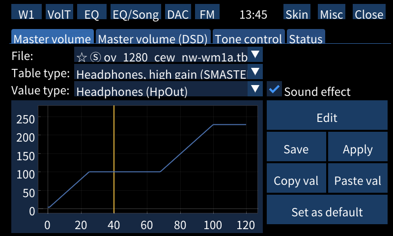
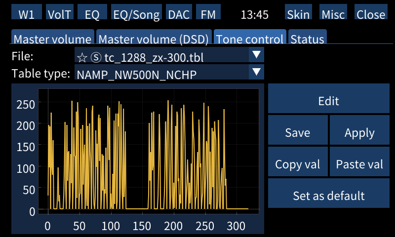
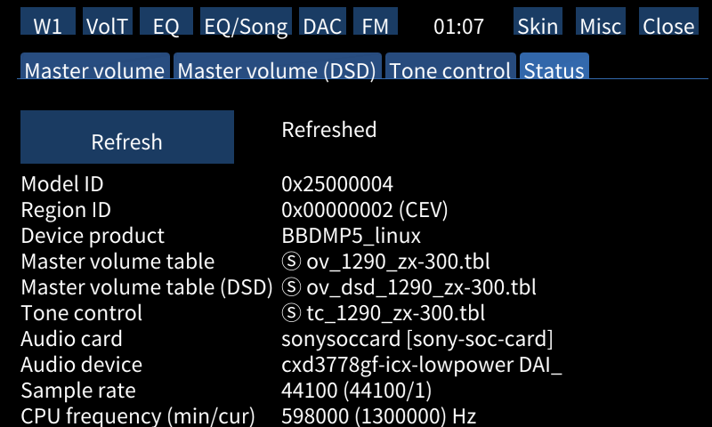

# Volume tables

<!-- TOC -->

* [Volume tables](#volume-tables)
  * [Table types](#table-types)
    * [Master volume](#master-volume)
    * [Value editor](#value-editor)
    * [Master volume, DSD](#master-volume-dsd)
    * [Tone control](#tone-control)
    * [User-provided tables](#user-provided-tables)
    * [Status](#status)
  * [Other issues](#other-issues)
  * [See also](#see-also)

<!-- TOC -->

NW-* series have digital amplifier S-Master HX™ technology powered by CXD3778GF chip.
Amplification rate depends on current volume value; you can change that rate by tuning chip configuration
using `volume->amplify rate` tables (or simply, volume tables).
They impact sound signature and are loaded on boot. On Walkman One these are known as "Gain mode".

Wampy provides interface for manipulating those tables.

## Table types

Supported:

- master volume
- master volume (dsd)
- tone control

Wampy comes with 6 master, 4 master dsd and 2 tone control tables. All of these are taken from stock firmwares of:
NW-A40, NW-A50, WM1A, WM1Z, ZX-300. These devices share tables, and sometimes they have different names, but same
content. DMP-Z1 does not have these at all (different SOC). NW-A30 uses tables which are incompatible with other
devices.

Here are default tables for each device:

<table>
  <tr align="center">
    <td>Device product</td>
    <td colspan="2">BBDMP5_linux</td>
    <td colspan="4">BBDMP3_linux</td>
    <td colspan="4">BBDMP2_linux</td>
  </tr>
  <tr align="center">
    <td>Model ID</td>
    <td colspan="2">0x250000 (A50)</td>
    <td colspan="2">0x230000 (ZX300)</td>
    <td colspan="2">0x240000 (A40)</td>
    <td colspan="2">0x200000, 0x210000 (WM1A/Z)</td>
    <td colspan="2">0x220000 (A30)</td>
  </tr>
  <tr align="center">
    <td>Region</td>
    <td>CEW2, KR3</td>
    <td>Others</td>
    <td>CEW2</td>
    <td>Others</td>
    <td>CEW2, KR3</td>
    <td>Others</td>
    <td>CEW2</td>
    <td>Others</td>
    <td>CEW2</td>
    <td>Others</td>
  </tr>
  <tr align="center">
    <td>Volume table</td>
    <td>ov_1291_cew ov_dsd_1291_cew</td>
    <td>ov_1291 ov_dsd_1291</td>
    <td>ov_1288_cew ov_dsd_1288_cew</td>
    <td>ov_1288 ov_dsd_1288</td>
    <td>ov_1290_cew ov_dsd_1290_cew</td>
    <td>ov_1290 ov_dsd_1290</td>
    <td>ov_127x_cew ov_dsd_127x_cew</td>
    <td>ov_127x ov_dsd_127x</td>
    <td>ov_1280_cew ov_dsd_1280_cew</td>
    <td>ov_1280 ov_dsd_1280</td>
  </tr>
  <tr align="center">
    <td>Tone control</td>
    <td colspan="2">tc_1291</td>
    <td colspan="2">tc_1288</td>
    <td colspan="2">tc_1290</td>
    <td colspan="2">tc_127x</td>
    <td colspan="2">tc_1280</td>
  </tr>
</table>

Your sound signature without any software effects is affected by those files on boot and depends on: model id, device
product and region. Only two regions matter at this stage of processing - CEW2 and KR3 (region names taken from Walkman
One). Other regions affect sound on software level. `_cew` tables have much lower volume.

After deduplication there were a handful of files left. You can check which files were deduplicated
in [this file](https://github.com/unknown321/wampy/blob/master/tunings/uniq.txt). Yes, Walkman One uses tables from
other firmwares without any modifications; same with Eclipse. Model suffix indicates firmware it was taken from with
stock priority over mods.

### Master volume

System files are marked by Ⓢ symbol; you cannot save these, but you can make a copy.

Master volume table structure:

<table>
<tr>
<td></td>
<td colspan="9">Sound effect OFF</td>
<td colspan="9">Sound effect ON</td>
</tr>
<tr>
<td>Table type</td>
<td colspan="3">Headphone</td> <td colspan="3">Balanced output</td> <td colspan="3">Others</td>
<td colspan="3">Headphone</td> <td colspan="3">Balanced output</td> <td colspan="3">Others</td>
</tr>

<tr>
<td>Value type</td>
<td>LineOut</td> <td>Headphones</td> <td>Others</td> <td>LineOut</td> <td>Headphones</td> <td>Others</td> <td>LineOut</td> <td>Headphones</td> <td>Others</td>
<td>LineOut</td> <td>Headphones</td> <td>Others</td> <td>LineOut</td> <td>Headphones</td> <td>Others</td> <td>LineOut</td> <td>Headphones</td> <td>Others</td>
</tr>
</table>

Every value type has 120 values, one value per volume point. Value range: 0-255.

On image above you can see that at current volume (~40, X axis, indicated by red line) output for headphones on high
gain using HpOut output will be modified by a value ~100 (Y axis).

What does that value means? Depends on value type. For example, `Play` type works in opposite direction, the less value
is, the louder is output.

Use buttons `Copy val` and `Paste val` to copy and paste values from/to currently selected value type (everything on
graph). Press `Edit` to edit values. `Apply` immediately applies changes. Press `Save` to save file
to `internal storage/wampy/sound_settings/master_volume/` directory. `Set as default` makes currently shown table
default - it will apply after toggling wampy for the first time after booting the device. To reset default tables, use
`Set default volume tables` button in `Misc` tab.

There are 26 table types and 13 value types specified by codec; you usually want to change `Play` and `Headphones` types
for `Headphones, high gain` table. Feel free to experiment.

Volume tables are NOT applied after reboot, you have to load them manually. There might be an option for automatically
loading them later.

### Value editor

Drag point wherever you want it to be. `Reset` button resets everything that happened on editor screen (and only
there).

There is no multitouch and panning, use buttons.

You **will** experience rendering issues on this screen. Yes, this is a bug; it will not be fixed.

There is also an online editor - https://unknown321.github.io/wampy/.

### Master volume, DSD

DSD tables are simpler. There is no sound effect toggle and value type, just table type. You are interested in `DSD*`
tables. X-axis: 120 values. Value range: 0-32768.

### Tone control

This table is **NOT** related to tone control settings in Walkman application. You are interested in `SAMP_GENERAL_HP`
table (maybe `NAMP_GENERAL_HP`?), others are for NW500/700 headphones. X-axis: 320 values. Value range: 0-256.

### User-provided tables

You can put tables modified by someone else to `internal storage/wampy/sound_settings/<table type>/` directory. File
list is automatically refreshed after toggling Wampy interface; you can manually refresh it by tapping on "♪♫" button.

### Status

Press "Refresh" to get actual values. Press on "Refreshed" label to remove it.

At this page you can see your model, region and device product, which affect volume table loaded by default.

Tables shown are tables currently in use.

Audio card, audio device and CPU frequency change depending on type of currently played file (DSD/HiRes) and on Walkman
One Plus mode status.

## Other issues

Switching sound setting tabs may fail if you tap too quickly and very unlucky. Just tap again to switch.

## See also

[Making of volume tables](./MAKING_OF_VOLUME_TABLES.md)
